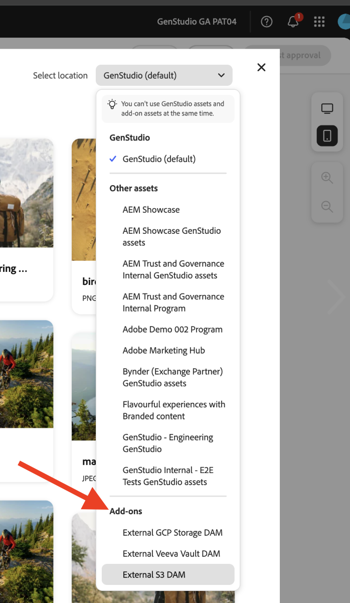

# アプリのデプロイ

アプリを実行すると、デプロイ前にアドオンの動作の予備スナップショットが提供されます。 これはデバッグに役立ちます。

## アプリの実行

`https://localhost:9080` でアプリを実行します。

```bash
aio app run
```

## アプリのデプロイ

1. デプロイメント ワークスペースに移動します。

   ```bash
   aio app use -w [deployment_workspace]
   ```

2. アプリをデプロイします。

   ```bash
   aio app deploy
   ```

## 再デプロイメントを強制

アプリを承認用に再送信しなくても、アプリのビルドとデプロイメントを強制的に行うことができます。

>[!NOTE]
>
>ビルドおよびデプロイメントを強制的に実行すると、既存のデプロイメントが上書きされます。 最初にテスト環境で **アプリを十分にテストします**。

```bash
aio app build --force-build
```

```bash
aio app deploy --force-deploy
```

## ビルドとデプロイを同時に

```bash
aio app deploy --force-build --force-deploy
```

## 新しいアプリの検索

デプロイ後、GenStudio for Performance Marketingで新しいアプリを表示できます。

### URL で表示

`query` パラメーターをGenStudio for Performance Marketingの URL に追加して、新しいアプリを確認します。

```txt
https://experience.adobe.com/?ext=https://<my-deployed-add-on>.adobeio-static.net/index.html#/@<ims-org>/genstudio/create
```

### UI で表示

新しい拡張機能は、デプロイした拡張機能のタイプに応じて、UI の様々な場所に表示されます。 現在利用可能な拡張ポイントは次のとおりです。

* コンプライアンス拡張機能。次の機能が含まれます。
   * [*プロンプト拡張ポイント*](#find-prompt-extensions)：顧客は LLM 生成にコンテキストを追加できます。
   * [*検証拡張ポイント*](#find-validation-extensions)：顧客が LLM から生成されたコンテンツを検証できます。 検証は、多くの場合、迅速な延長と組み合わされて、延長された迅速なコンテンツが顧客の要件（例えば、医療用医薬品の請求や法務）に準拠していることを確認します
* [デジタルアセット管理（DAM）拡張機能](#find-dam-extensions)
* [テンプレート拡張機能](#find-template-extensions)
* [翻訳拡張機能](#find-translation-extensions)

### プロンプト拡張機能の検索

プロンプト拡張機能は、テンプレートの **パラメーターセクション** にある **アドオン** ドロップダウンで見つかります。

{width="600" zoomable="yes"}

アドオンダイアログが開き、LLM 生成用に追加する追加のコンテキストを選択できます。

{width="600" zoomable="yes"}

### 検証拡張機能の検索

検証拡張機能は、プロンプト生成後、結果と共に表示される右側のサイドナビで見つけることができます。

{width="600" zoomable="yes"}

選択した拡張機能を実行して、生成されたコンテンツを検証します。

{width="600" zoomable="yes"}

### DAM 拡張機能の検索

デジタルアセット管理（DAM）拡張機能は、テンプレートの **パラメーターセクション** でコンテンツを選択すると見つかります。 **場所を選択** ドロップダウンの下部を参照して、アドオンを表示します。

{width="600" zoomable="yes"}

### テンプレート拡張機能の検索

テンプレートを選択すると、テンプレート拡張機能が「**外部テンプレートアプリ**」タブに表示されます。 このタブは、選択するテンプレートアプリがある場合にのみ表示されます。

{width="600" zoomable="yes"}


### 翻訳拡張機能の検索

GenStudioのデフォルトの翻訳を使用する代わりに、翻訳拡張ポイントを使用して、プロキシを介して独自の翻訳サービスを導入します。
これらの拡張機能には UI の場所がありません。

拡張機能が登録されている場合は、提供された翻訳サービスが使用されます。 それ以外の場合は、デフォルトのGenStudio翻訳サービスが使用されます。


アドオンに満足したら、`query` パラメーターを指定せずに配布する準備が整います。

これで、[ アプリを配布 ](distribute-app.md) できます。
