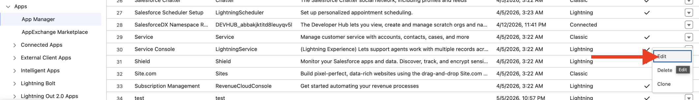
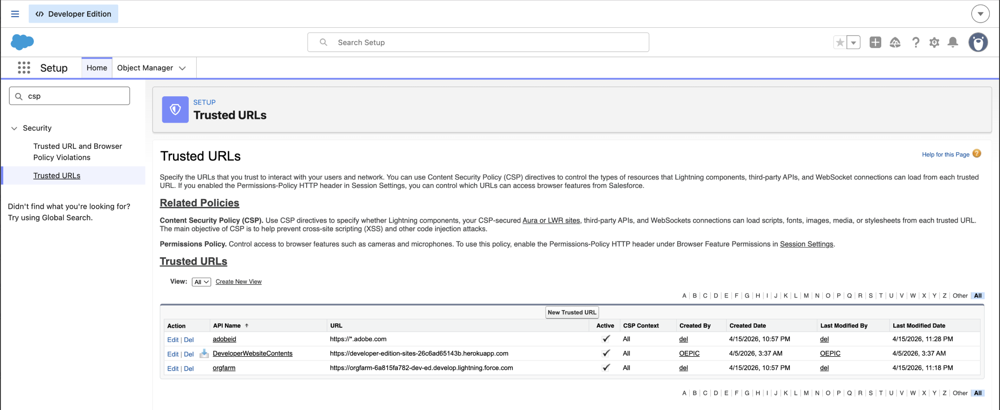

# SalesforceのExperience Selector MFE

このトピックでは、お客様と実装者がSalesforce組織で[!DNL GenStudio for Performance Marketing] Experience Selector マイクロフロントエンド（MFE）をデプロイして実行する方法について説明します。 管理者の手順（コードなし）、開発者手順（デプロイと設定）、およびコンテンツセキュリティポリシー（CSP）などのセキュリティ関連の設定について説明します。

汎用MFE統合オプション、設定プロパティ、およびフレームワークの例については、[GenStudio Experience Selector MFE](experience-selector.md)を参照してください。

## この統合で何ができるか

>[!VIDEO](https://video.tv.adobe.com/v/3491079?learn=on)

Lightning Web コンポーネント （LWC） `sfgsmfe`は、Adobe Experience Selector UMD バンドルを読み込み、`<dialog>`にレンダリングして、ユーザーが[!DNL GenStudio for Performance Marketing]からエクスペリエンスを選択できるようにします。

統合では、次の操作も実行できます。

* **プレビューとデコード：**&#x200B;選択したペイロードをJSON、デコードされたHTML、およびサニタイズされたHTML プレビューとしてLWC内に表示します。
* **電子メールテンプレート （オプション）:** Salesforceの&#x200B;**[!UICONTROL 電子メールテンプレートの作成]** フローでは、Apex （`EmailTemplateController.createEmailTemplate`）を呼び出して、`EmailTemplate` レコード （HTML、件名、フォルダー）を挿入できます。

[!DNL GenStudio for Performance Marketing]のエクスペリエンスセレクタースクリプトは、一般的な実装のSalesforce静的リソースからではなく、`experience.adobe.com`上のAdobeのホスト URLから読み込まれます。

## 前提条件

* **Salesforce組織：** メタデータをデプロイして&#x200B;**[!UICONTROL Lightning App Builder]**&#x200B;を使用できるサンドボックスまたは実稼動組織。
* **Salesforce CLI:** Salesforce CLI （`sf`）がインストールされ、認証されています。次に例を示します。

  ```bash
  sf org login web --alias <your-org-alias>
  ```

* **権限：** メールテンプレートを作成するユーザーには、組織のポリシーに従ってテンプレートを作成するためのターゲットメールテンプレートフォルダーと権限へのアクセス権が必要です。 Apexが`with sharing`を実行しています。
* **Adobe / GenStudio:**&#x200B;お使いのAdobe IMS組織IDとSUSI `clientId`は、お使いのAdobe設定と一致している必要があります（[統合値の設定](#configure-integration-values-developer--implementation)を参照）。
* **ブラウザー / CSP:** Salesforceでは、`https://experience.adobe.com`からのスクリプトの読み込みが許可されている必要があります（[ コンテンツセキュリティポリシーとAdobe URLの設定](#configure-content-security-policy-and-adobe-url)を参照）。

## パッケージのデプロイ（開発者）

プロジェクトはSalesforce DX レイアウトを使用しています。既定のパッケージ ディレクトリは`force-app`です。

1. プロジェクトのルートから、ソースをターゲット組織にデプロイします。

   ```bash
   sf project deploy start --source-dir force-app --target-org <your-org-alias>
   ```

2. エラーなしでデプロイメントが完了することを確認します。

* `force-app/main/default/lwc/sfgsmfe` — LWC バンドル （HTML、JS、CSS、meta）。
* `force-app/main/default/classes/EmailTemplateController.cls` — テンプレート作成用Apex。

リポジトリに静的リソース （`reactApp`、`sfgsmfe_react`）を含めることもできます。 `sfgsmfe.js`の現在の[!DNL GenStudio for Performance Marketing] ローダーは、`standalone.js`のAdobe CDN URLを使用しています。これらの静的リソースは、実装を変更しない限り、そのロード パスに必要ありません。

## Lightning ページへのコンポーネントの追加（管理者）

`sfgsmfe` コンポーネントは次の目的で公開されています：

* Lightning アプリページ
* ホームページ
* レコードページ
* タブ（カスタムタブのLightning ページ経由）

コンポーネントを追加するには：

1. **[!UICONTROL セットアップ]**&#x200B;で、**[!UICONTROL App Manager]**&#x200B;を開きます。
1. **[!UICONTROL 新しいLightning アプリ]**を作成します（または、拡張する既存のアプリを開きます）。
   {width="80%" zoomable="yes"}
1. アプリを開き、**[!UICONTROL 編集]**を選択します。
   {width="80%" zoomable="yes"}
1. **[!UICONTROL 新しいページ]**を作成（または既存のLightning ページを編集）。
   {width="60%" zoomable="yes"}
1. **[!UICONTROL Lightning App Builder]**&#x200B;で、**sfgsmfe** コンポーネントをレイアウトにドラッグします。
1. **[!UICONTROL 保存]**、**[!UICONTROL アクティベート]**&#x200B;し、ページを適切なLightning アプリ、プロファイル、およびアプリの表示に割り当てて、目的のユーザーが開けるようにします。

## コンテンツセキュリティポリシーとAdobe URLの設定

LWCは、`src` ポイントの`<script>` タグをAdobeのUMD バンドルに挿入します。例：

`https://experience.adobe.com/solutions/GenStudio-experience-selector-mfe/static-assets/resources/@genstudio/experience-selector/umd/standalone.js`

組織のCSPおよびLightning セキュリティ設定に従って、このオリジンがスクリプト読み込みに許可されるように、Salesforceを設定する必要があります。

スクリプトの読み込みに失敗した場合：

1. ブラウザーの開発者向けツールを開きます。
1. ブロックされたリクエストまたはCSP違反については、**[!UICONTROL コンソール]**&#x200B;および&#x200B;**[!UICONTROL ネットワーク]** タブを確認してください。
1. Lightningの現在のSalesforce ドキュメントに従って、`https://experience.adobe.com`の&#x200B;**[!UICONTROL 信頼できるURL]** （およびSalesforce リリースの関連する設定）を追加または調整します。
   {width="80%" zoomable="yes"}

## 統合値の設定（開発者/実装）

`sfgsmfe`のLWC JavaScriptにはいくつかの値が設定されています。 顧客は通常、環境ごとにこれらを置き換えます。

| 値 | 説明 |
| --- | --- |
| `folderId` | 新しいテンプレートが作成されるメールテンプレートのSalesforce フォルダーID （`00l...`）。 Apexには必須です。フォルダーが存在し、実行中のユーザーがアクセスできる必要があります。 |
| `imsOrg` | Adobe IMS組織のIDが`GenStudioExperienceSelector.renderExperienceSelectorWithSUSI`に渡されました。 |
| `susiConfig.clientId` | Experience Selector アプリ登録用のAdobe SUSI クライアント ID。 |
| GenStudio `script.src` | UMD `standalone.js` バンドルのURL。Adobeが新しいパスを公開する場合に更新します。 |

メールテンプレートの作成は、GenStudio フィールドをテンプレートにマッピングします（例えば、`experienceFields`の件名）。 コンテンツモデルが異なる場合は、LWCでマッピングを調整します。

`renderExperienceSelectorWithSUSI`と関連オプションについて詳しくは、「エクスペリエンスセレクターMFE」トピックの[設定プロパティ ](experience-selector.md#configuration-properties)を参照してください。

## Apex: EmailTemplateController

`EmailTemplateController.createEmailTemplate`は通常：

* テンプレート名、フォルダーID、空でないHTMLを検証します。
* `EmailTemplate`を作成し、`TemplateType = 'custom'`、`HtmlValue`、`Subject`、`Body`およびフォルダーの割り当てを指定します。
* `AuraHandledException`を通じてLWCにエラーを表示します。

運用のヒント：

* 組織内のDeveloperNameの一意性と命名ルールを尊重します。
* フォルダーIDと、ユーザーがそのフォルダーに`EmailTemplate`件のレコードを作成できることを確認します。
* DMLが正確なエラーを取得できない場合は、Salesforceのデバッグログを使用します。

## 検証チェックリスト

デプロイメントと設定の後、このリストの項目を確認して、統合を確実に検証します。

1. デプロイメントはエラーなしで完了します。
1. ユーザーは`sfgsmfe`を含むLightning ページを開き、エクスペリエンスセレクターUIを確認できます。
1. コンポーネントに読み込みエラーが表示されません。ネットワーク タブは、`standalone.js`に対してHTTP 200を返します。
1. **[!UICONTROL GenStudio エクスペリエンスを選択]**&#x200B;すると、セレクターが開き、選択コールバックが実行されます。
1. **[!UICONTROL メールテンプレートの作成]**&#x200B;は、そのフローを使用すると成功し、テンプレートは&#x200B;**[!UICONTROL 設定]**&#x200B;の設定済みフォルダーの下に表示されます。

## 関連トピック

* [GenStudio Experience Selector MFE](experience-selector.md)
