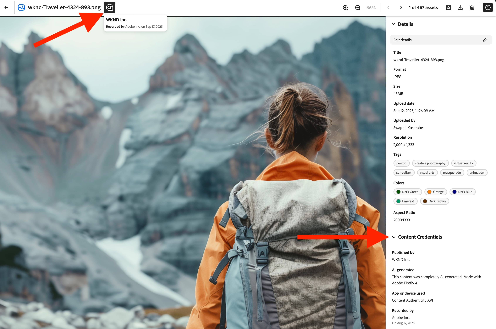
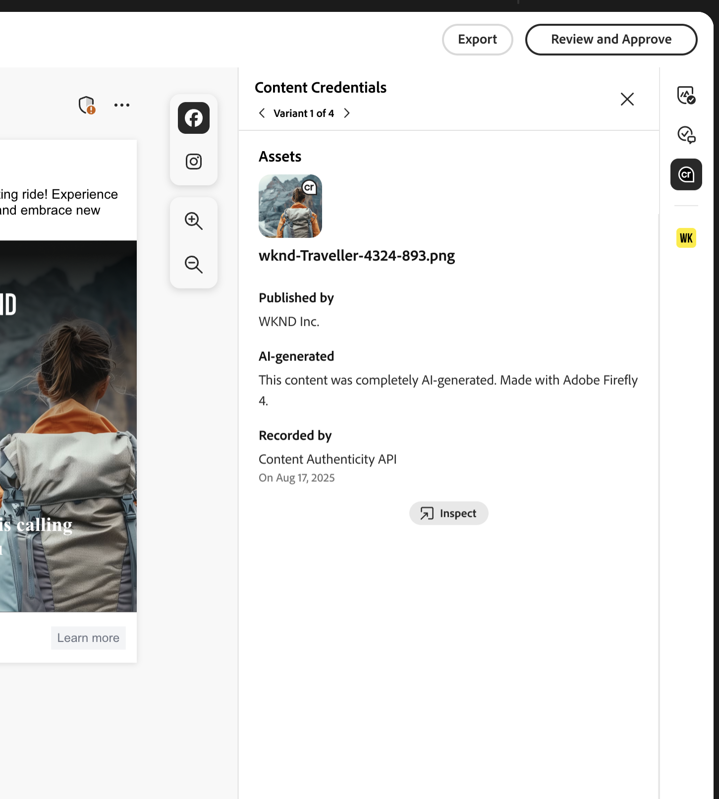
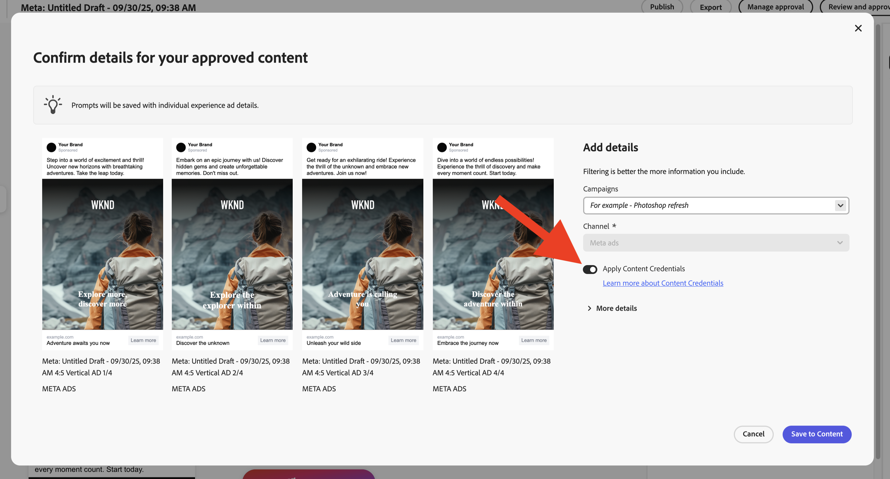

# Content Credentials法人版

ブランドの信頼性を証明し、コンプライアンスを促進するコンテンツの改ざん防止のための資格情報が、マーケティングワークフローに直接組み込まれる方法をご確認ください。

>[!WARNING]
>
> この機能は現在ベータ版で、アクセスが許可された組織のみが利用できます。 ご興味のある方は、Adobeの担当者までお問い合わせいただくか、[このリンクを使用して登録をリクエストしてください](https://www.feedbackprogram.adobe.com/c/a/5aWPEOthrDv22Mf9CyekOy?source=qr)。

## Content Credentialsの導入方法 {#content-credentials}

>[!CONTEXTUALHELP]
>id="gspm_content_credentials"
>title="[!DNL GenStudio for Performance Marketing]のContent Credentials"
>abstract="ブランドの信頼性を証明し、コンプライアンスを促進するコンテンツの改ざんを防ぐ資格情報を、マーケティングワークフローに直接組み込むことができます。"

Content CredentialsがAdmin Consoleでアクティベートされた後、GenStudio for Performance Marketing ユーザーはアプリ内のすべてのアセットに対してContent Credentialsを有効にすることができます。 認証情報を適用するグローバルオプションがオフになっている場合、ユーザーは個々のアセットに対してContent Credentialsを適用するオプションを選択できます。

コンテンツが公開されると、LinkedInなどの外部プラットフォームにContent Credentialsが表示されます。

管理者は、Admin Console内で有効なX.509証明書をアップロードする責任があります。 この手順により、企業のデジタル署名が適切に設定され、サポートされているAdobe DX アプリケーションで使用できる状態になります。

>[!NOTE]
>
>この設定の制御は、将来的にAdmin Consoleに移行する可能性があり、アプリケーション間のContent Credentialsの管理を合理化し、管理上の監視を強化します。

## Content Credentialsとは？ 

Content Credentialsは、業界標準の耐久性のあるメタデータであり、コンテンツの制作方法やクリエイターのID情報が記載されています。 Content Credentialsは、コンテンツがサポートするプラットフォームにオンラインで公開されている場合、または[Adobeの検査ツール ](https://contentauthenticity.adobe.com/inspect)や[Adobe Content Authenticity Chrome ブラウザー拡張機能](https://helpx.adobe.com/creative-cloud/help/cai/adobe-content-authenticity-chrome-browser-extension.html)などのツールを使用して表示できます。  

Content Credentialsを導入すれば、コンテンツの制作方法の透明性を高め、オーディエンスがコンテンツを活用できるようになります。

[AdobeでContent Credentials](https://helpx.adobe.com/jp/creative-cloud/help/content-credentials.html)の詳細を確認します。

## ブランド署名とアセット追跡

ブランド署名コンテンツは、ブランドの整合性とユーザーの信頼を促進する上で重要な役割を果たします。 組織は、Admin Consoleで証明書が適切に設定されている場合、Adobe アプリケーションで一意のブランド署名を使用してコンテンツに署名できます。 この信頼性の保証は、目に見えない透かしとフィンガープリント技術を使用して維持され、コンテンツのライフサイクル全体を通じて署名の耐久性を維持するのに役立ちます。

企業は、ブランドへの署名に加えて、アセット IDをコンテンツに直接添付できます。 これにより、特にソーシャルメディアプラットフォームで共有または投稿されたアセットを効率的に追跡できます。 アセット IDを組み込むことで、コンテンツの由来と配信パスを追跡し、管理と説明責任を強化することができます。

## マーケティングワークフローにおけるContent Credentials

Content Credentialsの導入は、インポートやコンテンツの発見からアクティベーション、エクスポートに至るまで、マーケティングワークフロー全体を通じて、GenStudio for Performance Marketingで直接実行できます。 また、アプリ全体でレビュー用にコンテンツに表示される資格情報もあります。

### 読み込みと検出

コンテンツギャラリーでは、読み込んだアセットに認証情報が表示されます。

サムネールの右上隅にあるContent Credential バッジは、「ブランド署名済み」コンテンツを示します。

署名済みコンテンツを選択すると、公開されたブランド、レコーダー、使用されたツール、タイムスタンプなどの詳細なメタデータが表示されます。

コンテンツは、資格情報のステータスでフィルタリングできます。

### コンテンツの制作と選択

Content Credentialのバッジは、Canvas Asset セレクターに表示されます。

エクスペリエンスでアセットを選択すると、編集中に来歴チェーンを維持するために資格情報のメタデータが保持されます。

### 編集と変換

ドラフトからの書き出し中に、変更されたアセットは自動的に再署名され、新しい資格情報は元のアセットにリンクされます。

{width="60%"}

### レビューと承認

レビューと承認プレビューでは、右側のパネルにアセットの資格情報ステータスが表示されます。

{width="60%"}

レビュー担当者がアセットを調査すると、バリエーションごとの資格情報の詳細が表示されます。 ユーザーが「**[!UICONTROL コンテンツに保存]**」をクリックすると、承認済みエクスペリエンスが再署名されます。

### アクティベーションとエクスポート

アクティベーション中、資格情報のステータスがエクスペリエンスセレクターに表示されます。

アクティブ化されたアセットの{width="60%"}

書き出されたファイルには、C2PA準拠の資格情報が埋め込まれます。

資格情報の一貫性は、サポートされているすべてのフォーマット（JPEG、PNG、MP4）で維持されます。

