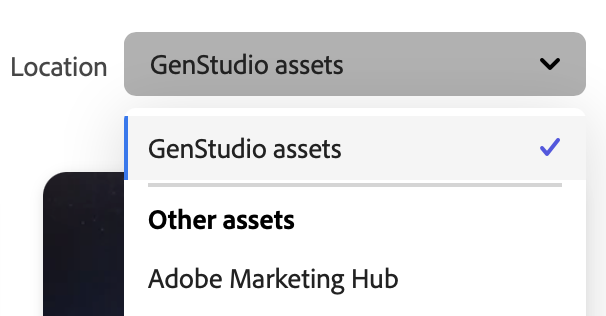

# アセットとエクスペリエンスの管理

Adobe GenStudio for Performance Marketing [!DNL Content] は、デジタルマーケティングジャーニーでの使用と再利用のために、ブランド承認済みアセットの管理を簡素化および強化します。

## コンテンツギャラリー

ギャラリーには、選択した表示に応じて、承認されたアセット、エクスペリエンスまたはテンプレートのインベントリが表示されます。 テーブルの左側の上にあるフィルター（ファネル）アイコンをクリックすると、**[!UICONTROL フィルター]** メニューが開き、多数のカテゴリから選択して、ギャラリーに表示されるコンテンツをフィルタリングできます。 _[!UICONTROL Assets]_ ビューで、検索（虫眼鏡）アイコンをクリックし、キーワードを使用してアセットを検索します。

以下は、[!UICONTROL Assets] ギャラリーの用語 `dog` に対する検索を示しています。

### コンテンツを検索

このフィルターと検索のインターフェイスは迅速かつレスポンシブで、生産的な検索ファーストのエクスペリエンスを提供します。 各 [!DNL Content] 表示には、理想的なアセット、エクスペリエンスまたはテンプレートを絞り込むためのフィルターオプションが用意されています。 アセットとエクスペリエンスの場合は、キャンペーンと特定のガイドライン（特定の製品に対して作成されたコンテンツなど）を選択できます。

[ キーワード ](asset-details.md#user-defined-metadata) および [ 属性カテゴリ ](/help/user-guide/insights/attribute-category.md) に基づいて、検索結果を絞り込むフィルターがあります。 例えば、キャンペーンの新しいエクスペリエンスを構築するのに役立つ、特定のファイルタイプや件名のアセットを検索することができます。

_エクスペリエンス_ を検索する場合、**[!UICONTROL 作成者]** フィルターを使用して、自分または特定のユーザーが作成したエクスペリエンスのみを表示するようにリストを制限できます。

**再利用するコンテンツを検索するには**:

1. _[!DNL Content]_で、「**[!UICONTROL Assets]**」セクションを選択します。

1. **[!UICONTROL 場所]** リストからアセットリポジトリを選択するか、正しいアセットリポジトリを表示していることを確認します。 デフォルトのリポジトリは `GenStudio assets` です。

   >[!IMPORTANT]
   >
   >_場所_ リストを使用できるのは [AEM リポジトリに接続 ](connect-aem-repo.md) している場合のみです。

1. **[!UICONTROL 検索]** （虫眼鏡）をクリックして、キーワードまたは説明を入力します。

1. _[!UICONTROL フィルター]_ リストからカテゴリを選択して、検索を絞り込みます。 例えば、PNG ファイルを検索する場合は、「**[!UICONTROL ファイル形式]**」をクリックし、「**PNG**」を選択します。

   検索を絞り込めば絞り込むほど、使用できるフィルターオプションが少なくなります。 すべてのフィルターを削除するには、「**[!UICONTROL すべてクリア]**」をクリックします。

1. 全体表示および詳細リスト用のアセットを選択します。

   **[!UICONTROL ダウンロード]** （下矢印）をクリックして、ローカルワークステーションでアセットを使用します。

### Location

デフォルトでは、[!DNL Create] プロセスまたはアップロードを通じて [!DNL Content] に追加したアセットは、`GenStudio assets` リポジトリに保存されます。 `GenStudio assets` リポジトリは、GenStudio for Performance Marketingの読み取り/書き込みリポジトリです。 つまり、`GenStudio assets` リポジトリ内のアセットを保存、編集、削除できます。

右側の _[!UICONTROL Assets]_ ギャラリーの上にある **[!UICONTROL Location]** リストでは、接続されたAdobe Experience Manager（AEM） [!DNL Assets Content Hub] ータリポジトリから選択できます。

{width="350"}

AEM リポジトリを選択すると、そのリポジトリのアセットのインベントリがギャラリーに表示され、承認されたアセットをコンテンツ作成用の入力として活用できます。 フィルターオプションは、[!DNL AEM Assets Content Hub] で設定されたカテゴリを反映して変更されます。

[AEM リポジトリをGenStudio for Performance Marketingに追加する方法については、[!DNL AEM Assets Content Hub] リポジトリの接続 ](connect-aem-repo.md) を参照してください。

AEM リポジトリーは読み取り専用です。つまり、コンテンツにアクセスできますが、ドラフト、新しいアセットまたはメタデータをAEM リポジトリーに保存することはできません。 アセット、エクスペリエンスおよびテンプレートのすべてのドラフトと最終更新は、新しい [ システムメタデータ ](asset-details.md#system-metadata) とともに `GenStudio assets` リポジトリに保存されます。

{{note-aem-assets}}

## Assets管理

[!UICONTROL  コンテンツ ] では、パフォーマンスマーケティングでデジタルアセットを簡単に保存、取得および管理できます。 `GenStudio assets` リポジトリーとAEM リポジトリーの両方を活用することで、アセットが適切に整理され、様々なマーケティングキャンペーンからアクセスできるようになります。 このマルチリポジトリアプローチは、環境全体でのアセットの使用を柔軟に制御し、承認された最新のアセットのみをマーケティング活動で使用できるようにします。

### アセットの追加

アセットを [!DNL Content] に追加すると、デフォルトでは、`GenStudio assets` リポジトリに保存されます。 「_[!UICONTROL アセットを追加]_」ボタンは、「_[!UICONTROL 場所]_ が `GenStudio assets` リポジトリの場合にのみ使用できます。

{width="350"}

**1 つ以上のアセットを追加するには**:

1. _[!DNL Content]_で、「**[!UICONTROL アセットを追加]**」をクリックします。

1. _承認済みアセットを追加_ 表示で、ファイルをドロップスペースにドロップします。 オプションで、**[!UICONTROL 参照]** を使用してローカルファイルから選択したり、DropboxまたはMicrosoft OneDrive からファイルを読み込んだりできます。

1. 「_詳細を追加_」セクションで、**[!UICONTROL キャンペーン名]** を選択するか、新しい名前を入力します。

1. 検出性を向上させるには、「**詳細**」セクションに _ブランド名_、_ペルソナ_、_地域_、_キーワード_ などのオプションの詳細を追加します。

   提供する情報が多いほど、GenStudio for Performance Marketingの堅牢な機能を体験できます。 リストから 1 つ以上の詳細を選択するか、必要に応じて新しい詳細（キーワードを使用するなど）を入力します。 追加した各詳細は、リストの下に表示されます。 詳細を削除するには、「**`x`**」をクリックします。

   追加した詳細は、このアクションで追加されたすべてのアセットに適用されます。

   [ メタデータの詳細 ](/help/user-guide/content/asset-details.md#system-metadata) を参照してください。

1. **[!UICONTROL アセットを追加]** をクリックします。

1. アセットのアップロードが完了したら、「**完了**」をクリックします。

1. アップロードした新しいアセットを表示するには、キャンバスの下部にある _使用可能な新しいアセット_ 通知で **[!UICONTROL 更新]** をクリックします。

<!--
In the future, need guidance on template upload errors. For now, the UI just says error.
-->

### アセットのダウンロード

**アセットをダウンロードするには**:

1. _[!DNL Content]_で、画像アセットを選択します。 アセットをクリックすると、そのアセットのフォーカスされたビューが開きます。

1. アセットビューで、右上の「**[!UICONTROL ダウンロード]**」アイコン（下矢印）をクリックします。

1. ダウンロードにより、アセットのコピーがデフォルトのダウンロード場所に配置され始めます。

### アセットの削除

**アセットを削除するには**:

1. _[!DNL Content]_で、画像アセットを選択します。 アセットをクリックすると、そのアセットのフォーカスされたビューが開きます。

1. アセットビューで、右上の **[!UICONTROL 削除]** （ごみ箱）をクリックします。

1. _アセットを削除_ ポップアップで、アセットを確認し **[!UICONTROL 削除]** をクリックします。

## Express で編集

Adobe Expressを使用して、GenStudio for Performance Marketing内で画像アセット（JPGまたは PNG）を直接編集できます。 _[!UICONTROL Adobe Expressを利用]_ キャンバスには、GenStudio アプリケーションを離れることなく画像を強化できる便利な機能が用意されています。 背景の削除、ジェネレーティブフィルの適用、エフェクトの調整、画像の切り抜きを簡単に行うことができます。

>[!BEGINSHADEBOX]

[!DNL Edit in Adobe Express] の機能を使用して画像を強化するための条件：

- サポートされる MIME タイプには `image/png` と `image/jpeg` があります
- 画像の最小寸法は 50 x 50 ピクセルです
- 画像の最大サイズは 8000 x 8000 ピクセルです
- 最大サイズは 40 MB （40,000,000 バイト）です

>[!ENDSHADEBOX]

**Express でアセットを編集するには**:

1. _[!DNL Content]_で、画像アセットを選択します。 アセットをクリックすると、そのアセットのフォーカスされたビューが開きます。

1. アセットビューで、右上の **[!UICONTROL Adobe Expressで編集]** アイコンをクリックします。

1. _[!UICONTROL Powered by Adobe Express]_ キャンバスで、左側のパネルの Express コントロールを使用して、画像を強調します。

1. 更新された画像が気に入ったら、右上の **[!UICONTROL コピーを保存]** をクリックします。

1. ファイル形式（JPGまたは PNG）を選択し、「**[!UICONTROL コピーを保存]**」をクリックします。

1. _[!UICONTROL アセットのコピーを保存]_ ポップアップで **[!UICONTROL アセット名]** を更新します。

   - **[!UICONTROL 元のアセットと同じ詳細]** を選択して、アセットの詳細を新しい画像に引き継ぎます。

   - 「**[!UICONTROL 詳細]**」セクションを展開すると、ガイドラインやその他のメタデータを更新できます。

   >[!TIP]
   >
   >提供する情報が多いほど、GenStudio for Performance Marketingの堅牢な機能を体験できます。 リストから 1 つ以上の詳細を選択するか、必要に応じて新しい詳細（キーワードを使用するなど）を入力します。 追加した各詳細は、リストの下に表示されます。 詳細を削除するには、「**`x`**」をクリックします。

1. **[!UICONTROL 保存]**&#x200B;をクリックします。
