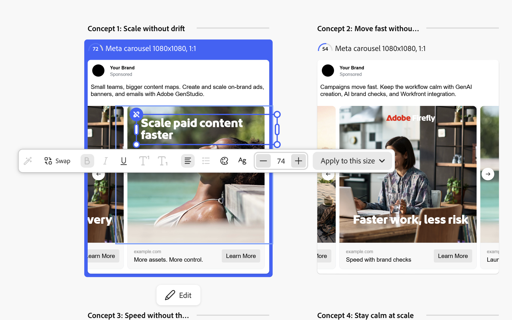

# Meta カルーセル広告エクスペリエンスの作成

Metaのカルーセル広告は、2枚から10枚のスワイプカードを表示する有料広告フォーマットで、それぞれに画像や動画、見出し、リンクが用意されています。

このページでは、カルーセル広告に固有の手順について説明します。 テンプレートの選択、パラメーターの追加、バリエーションの修正、公開など、このページで繰り返されない共通ステップについては、[Meta広告エクスペリエンスの作成](/help/user-guide/create/create-meta-ad.md)を参照してください。

## 前提条件

カルーセル広告を作成する前に、すべてのページで縦横比が1:1または4:5の1つであることを確認してください。 各テンプレートページは1枚のカードになります。 詳しくは、[Meta広告テンプレートガイドライン ](/help/user-guide/templates/meta-template.md)を参照してください。

## カルーセル形式の選択

テンプレートを選択してカンバスを開いた後、プロンプトドロワーでカルーセル形式を選択します。

1. _[!DNL Create your ads]_パネルで、_[!UICONTROL  パラメーター&#x200B;]_を展開します。
1. **[!UICONTROL 形式]** ドロップダウンメニューから、**[!UICONTROL カルーセル広告]**&#x200B;を選択します。

   {width="70%" zoomable="yes"}

単一ページのテンプレートから開始する場合、[!DNL GenStudio for Performance Marketing]は、2枚のカードの最小値を満たすためにページを複製します。 テンプレートページがすべて1つの縦横比を共有しない場合、一貫した縦横比を持つテンプレートを使用するまで、書式切り替えはブロックされます。

## カードの管理

生成する前に、プロンプトドロワーでカードセットを作成します。 さらにカードを追加するには、既存のカードを複製します。

* **カードを複製するには、カードオプションから「**[!UICONTROL &#x200B;複製&#x200B;]**」を選択します。**
* **カードを並べ替えるには、** カードのハンドルを新しい位置にドラッグします。
* **カードを削除するには、カードのオプションから**[!UICONTROL &#x200B;削除&#x200B;]**を選択します。**&#x200B;カルーセルには少なくとも2枚のカードが必要なので、最後の2枚のカードは削除できません。

各カードについて、1枚の画像を選択し、必要に応じて、親製品を上書きするカードごとの製品を設定します。 カードごとに1枚の画像を個別に選択します。 カードごとの宛先URLは、後で[!DNL Activate]に設定されます。 詳しくは、[Meta広告のアクティベート ](/help/user-guide/activation/activate-meta-ad.md)を参照してください。

## カルーセルプロンプトの作成

プロンプトはカルーセルの意図を示しているので、カード同士がどのように関連付けられているかを記述します。 カルーセルコピーは、次の2つのアプローチのいずれかに従います。

* **モジュール：**&#x200B;各カードは自己完結型の広告であり、複数のカードにまたがるコピーは表示されません。 このアプローチは、複数の製品など、関連性はあるが独立した一連のメッセージに使用します。
* **シーケンス：** コピーは、ストーリー、ステップバイステップのシーケンス、またはハウツーを伝えるために、カード間を接続します。 このアプローチは、カードが相互に構築される場合に使用します。

また、カルーセルに単一の製品と複数の製品のどちらを含めるか、さらにカードごとの詳細を含めるかを記述することもできます。

例えば、このプロンプトは、複数の製品を特徴とするモジュール式カルーセルについて説明します。

```properties
Create a multi-product carousel for our end-of-summer skincare sale. For each card, lead with the product's core benefit and emphasize the sale value.
```

このプロンプトは、5枚のカードにストーリーを伝える連続的なカルーセルを表します。

```properties
Create a narrative carousel for our compliance alert-management platform. Start with shared intro text about the cost of alert fatigue. Across five cards, build the story: rising review costs, too many low-value alerts, false positives as the hidden cost driver, a solution that cuts false positives by more than 50%, and a closing learn-more call to action.
```

プロンプトの基本については、[効果的なプロンプトの作成](/help/user-guide/effective-prompts.md)を参照してください。

## コンセプトの生成とレビュー

カードとプロンプトを設定したら、カルーセルを生成して結果を確認します。

1. 「**[!UICONTROL 生成]**」を選択します。

   [!DNL GenStudio for Performance Marketing]は4つのカルーセルコンセプトを生成します。 各コンセプトは、独自のブランドスコアを持つ完全なマルチカードカルーセルです。

   {width="80%" zoomable="yes"}

1. コンセプトを選択し、**[!UICONTROL 編集]**&#x200B;を選択して編集用に開きます。
1. 矢印を使用してカード間を移動し、テキストを編集するか、**[!UICONTROL スワップ]**&#x200B;を選択してカードの画像を変更します。 編集について詳しくは、[ バリエーションの管理](/help/user-guide/create/manage-variants.md)を参照してください。

生成前にカードを再注文すると、Canvasがすぐに更新されます。 生成後にプロンプトドロワーでカードを並べ替えた場合、変更は再生成後にのみ適用され、再生成警告が表示されます。

## カードごとのフィールドと共有フィールドについて

カルーセルフィールドの中には、各カードに個別に適用されるものもあれば、広告全体に適用されるものもあります。 次の表に、Meta カルーセル広告の各フィールドの動作を示します。

| フィールド | 範囲 |
|---|---|
| Headline | カードごと |
| 説明 | カードごと、オプション、[!DNL Activate]で設定 |
| Call to action | 広告全体で共有 |
| プライマリテキスト | 広告全体で共有 |
| メディア | カードごと（画像、ビデオ、または混合） |
| 画像テキスト | カードごと |
| 宛先 URL | カードごと、[!DNL Activate]に設定 |

## 公開、書き出し、アクティベート

カルーセルの準備ができたら、他のMeta広告と同じように公開して書き出します。 カルーセルは、1つの概念に対応する単一のエクスペリエンスとして保存されます。 書き出しでは、CSV ファイルとカードメディアが配信されます。 公開されたエクスペリエンスの保存方法については、[[!DNL Content]](/help/user-guide/content/overview.md)を参照してください。 カルーセルをMetaにアクティベートするには、[Meta広告のアクティベート ](/help/user-guide/activation/activate-meta-ad.md)を参照してください。
