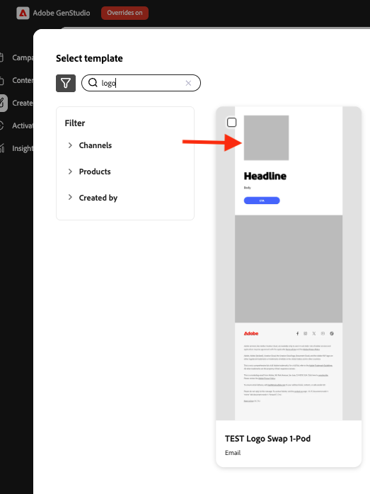

# [!DNL Create]でロゴの入れ替えを使用

[!DNL GenStudio for Performance Marketing]でのコンテンツ作成中に、ロゴスワップを使用してテンプレート内のブランドロゴを置き換えます。

## 前提条件

- [ ロゴの入れ替え設定ガイド ](logo-swap-setup.md)を使用してテンプレートを設定します。 ロゴの入れ替えアイコンは、必要なロゴプレースホルダーが含まれているテンプレートにのみ表示されます。
- **[!DNL Create]** ワークフロー中に変更可能なロゴを使用するには、**[!DNL Brands]**&#x200B;内にロゴが保存されている必要があります。

## コンテンツ作成時のロゴの入れ替え

1. **[!DNL Create]**&#x200B;で、ランディングページのチャネルを選択します。
1. スワップ可能なロゴを含むテンプレートを選択します。 テンプレートのプレビューには、ロゴが表示されるグレーのプレースホルダーボックスが表示されます。
   {width="300"}
1. 通常どおりコンテンツを作成します。 4つのバリエーションが表示されます。
1. ロゴ領域にカーソルを合わせると、プレースホルダーが表示されます。
   {width="200"}
1. 「ブランドロゴ」領域をクリックし、「**[!UICONTROL コンテンツから入れ替え]**」をクリックします。
   {width="200"}
1. ブランドロゴパネルで、ロゴを選択し、**[!UICONTROL 使用]**&#x200B;をクリックして現在のバリエーションに適用するか、**[!UICONTROL すべてのバリエーションに適用]**&#x200B;して4つのバリエーションすべてに適用します。
1. ブランド名やフィルターで検索ロゴを使用して、ロゴを見つけることもできます。
   {width="300"}
1. または、フィルター検索を使用してロゴを検索します。
   {width="300"}
1. ロゴが正常に入れ替わった状態で、コンテンツ作成ワークフローを続行します（ドラフトを閉じる、書き出す、または承認をリクエストします）。

ロゴはいつでも再び入れ替えることができます。

>[!NOTE]
>ロゴの入れ替えアイコンが表示されない場合は、テンプレートがロゴの入れ替え用に設定されており、ロゴが[!DNL Brands]で使用可能であることを確認します。
