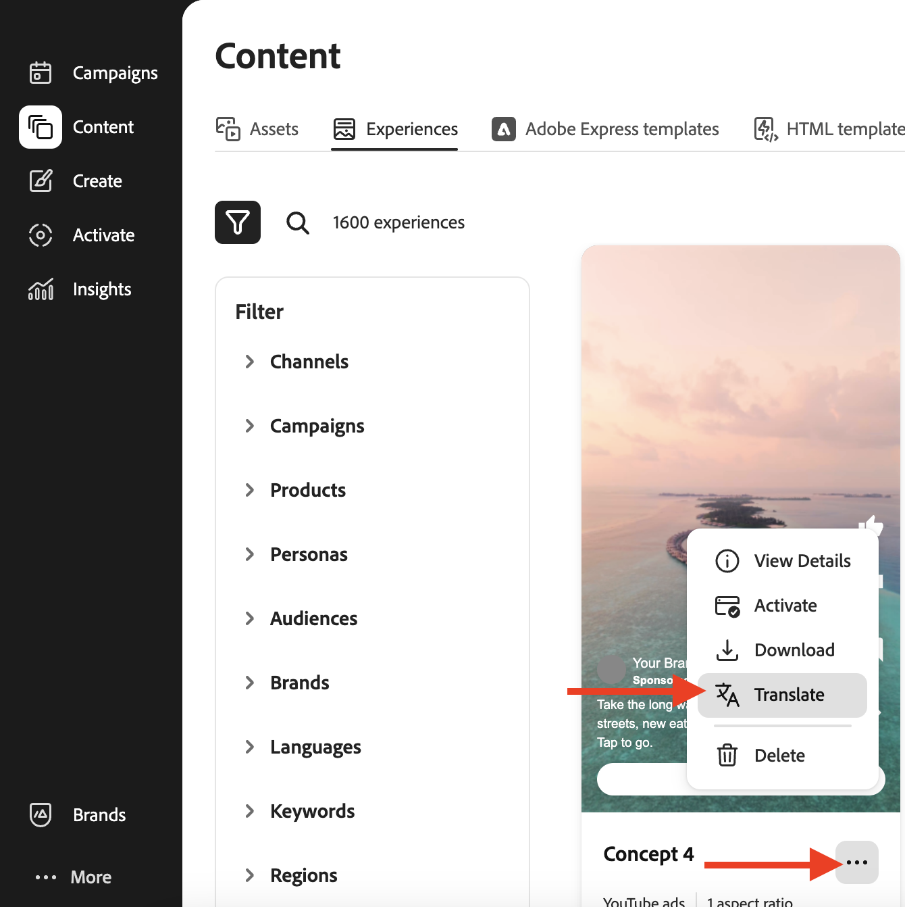

# エクスペリエンスの翻訳とローカライズ

Adobe [!DNL GenStudio for Performance Marketing]では、HTML キャンバスですぐに利用できる翻訳機能が用意されているため、グローバルおよび地域のマーケターは、外部の翻訳ツールを使用せずに、承認済みのエクスペリエンスを複数の言語に拡張できます。

この機能は、デフォルトでAzure Open AIを使用します。 組織は、[翻訳拡張機能](/help/extensibility/deploy-app.md#find-translation-extensions)を通じて任意の翻訳サービスを接続することもできます。

翻訳は、[!DNL Content]に保存された承認済みエクスペリエンスから開始します。 ソース体験は任意の言語で提供できます。 翻訳された各バリエーションは、[!DNL Create] キャンバスで編集可能なドラフトとして開き、書き出し、レビュー用に送信し、別のエクスペリエンスとして公開できます。

## サポートされているエクスペリエンス

HTMLのカンバスですぐに使用できる翻訳では、次の機能をサポートしています。

* [ メールエクスペリエンス ](/help/user-guide/create/email-experiences.md)
* [Meta](/help/user-guide/create/meta-experiences.md)、[LinkedIn](/help/user-guide/create/linkedin-experiences.md)、[ ディスプレイ ](/help/user-guide/create/display-ad-experiences.md)広告などの有料メディア体験

## 開始する前に

翻訳するエクスペリエンスが&#x200B;**承認済み**&#x200B;であり、[!DNL Content] _[!UICONTROL エクスペリエンス]_ ギャラリーで利用できることを確認してください。 ドラフトまたはレビュー中のエクスペリエンスは、翻訳ソースの資格がありません。

組織がカスタム翻訳拡張機能を登録する場合、GenStudio for Performance MarketingはデフォルトのAzure Open AI翻訳の代わりにそのサービスを使用します。 [翻訳拡張機能の検索](/help/extensibility/deploy-app.md#find-translation-extensions)を参照してください。

## [!DNL Create]から翻訳 {#translate-from-create}

[!DNL Create] ランディングページから翻訳を開始して、承認済みエクスペリエンスをローカライズします。

{width="600" zoomable="yes"}でコピーを翻訳およびローカライズ

**[!DNL Create]**&#x200B;から翻訳するには：

1. [!DNL Create]で、_コンテンツ作成_ セクションまでスクロールします。
1. 「**[!UICONTROL コピーを翻訳してローカライズ]**」をクリックします。
1. 翻訳する承認済み電子メールまたは有料メディアエクスペリエンスを選択します。 「**[!UICONTROL 使用]**」ボタンをクリックします。
1. サポートされている言語のリストからターゲット言語を選択します。 「**[!UICONTROL 翻訳]**」をクリックします。

翻訳されたバリエーションがキャンバスに表示されます。

## [!DNL Content]から翻訳 {#translate-from-content}

また、承認済みエクスペリエンスを参照している場合は、[!DNL Content]から翻訳を開始することもできます。

### Experience ギャラリーから

{width="500" zoomable="yes"}

**エクスペリエンスギャラリー**&#x200B;から翻訳するには：

1. [!DNL Content]で、「**[!UICONTROL エクスペリエンス]**」タブを開きます。
1. 翻訳する承認済みエクスペリエンスを探します。
1. エクスペリエンスカードのオプション（3つのドット）メニューをクリックします。
1. 「**[!UICONTROL 翻訳]**」をクリックします。
1. サポートされている言語のリストからターゲット言語を選択します。 「**[!UICONTROL 翻訳]**」をクリックします。

## カンバスでの翻訳の操作

HTML キャンバスでは、ソースエクスペリエンスは既に承認されているため、編集できません。 電子メールソースエクスペリエンスがロックされているようです。 カンバス上で翻訳済みのバリエーションのテキストを直接編集できます。 バリエーションのコピーの編集に関するガイダンスについては、[ バリエーションの管理](/help/user-guide/create/manage-variants.md)を参照してください。

翻訳されたエクスペリエンスは、ブランド検証を実行したり、ブランドスコアを表示したりしません。 ソースエクスペリエンスはブランドのガイドラインと共に作成され、レビューおよび承認されています。

フラグメントの再生成は、翻訳されたエクスペリエンスではサポートされていません。

### 翻訳済み言語の削除

**翻訳済み言語をキャンバスから削除するには**:

1. [!DNL Create] キャンバスで、翻訳済みバリアント ヘッダーのオプション（3つのドット）メニューをクリックします。
1. 「**[!UICONTROL 削除]**」をクリックします。

{width="500" zoomable="yes"}

翻訳された言語がキャンバスから削除されます。

### 有料メディア翻訳の更新

翻訳された有料メディアコピーを編集した後、元の翻訳出力をリロードできます。

**有料メディア翻訳を更新するには**:

1. [!DNL Create] キャンバスで、編集済みの翻訳済みバリアントのオプションメニューを開きます。
1. 「**[!UICONTROL 翻訳を更新]**」をクリックします。

>[!NOTE]
>
>更新された翻訳は、有料メディアエクスペリエンスで使用できます。 メール翻訳は現時点では翻訳の更新をサポートしていません。

## 書き出し、レビュー、公開

翻訳がカンバスに読み込まれたら、翻訳を書き出して承認のために送信し、承認されたバリエーションを[!DNL Content]に公開できます。

**翻訳されたエクスペリエンスを書き出すには**:

1. [!DNL Create] キャンバスで、ツールバーの&#x200B;**[!UICONTROL 書き出し]**&#x200B;をクリックします。
1. 書き出し形式を選択します。
   * 電子メール：**CSVおよび画像**&#x200B;または&#x200B;**HTMLのみ**
   * 有料メディア：**CSV + JPG**、**CSV + PNG**、または&#x200B;**HTML + images**
1. 「**[!UICONTROL 書き出し]**」をクリックします。

 [!DNL Content]](/help/user-guide/content/manage-assets.md#export-experiences)から[ エクスペリエンスを書き出すこともできます。

**レビューと承認を依頼するには**:

1. [!DNL Create] キャンバスで、**[!UICONTROL 承認を依頼]**&#x200B;をクリックします。
1. 少なくとも1人の承認者を割り当てて、リクエストを送信します。

レビューワークフローの詳細については、[ レビューと承認の依頼](/help/user-guide/approvals/request-review.md)を参照してください。

**承認済みの翻訳を公開するには**:

1. 承認者が翻訳されたバリエーションを承認したら、**[!UICONTROL 公開]**&#x200B;をクリックします。
1. 公開ウィンドウで、キャンペーン名、タイムライン、地域、キーワードなどのメタデータを確認します。

[承認済みコンテンツを公開](/help/user-guide/approvals/publish-content.md)を参照してください。

公開された各翻訳は、個別のエクスペリエンスとして[!DNL Content]に保存されます。

## 翻訳されたエクスペリエンスメタデータ

公開された翻訳には、各バリエーションをそのソースにリンクするメタデータが含まれます。

* **タイトル** — パターン `Translation from "<source title>" <channel>`に従います（`Translation from "Summer campaign" Meta`など）
* **作成者** – 翻訳を開始したユーザー
* **作成日** – 翻訳日
* **翻訳済みソース** — [!DNL Content]のソースエクスペリエンスへのリンク
* **から翻訳済み** — ソース言語

## 制限事項

HTML キャンバスでエクスペリエンスを変換する際は、次の制約を考慮してください。

* ソースエクスペリエンスは既に承認され、[!DNL Content]に保存されている必要があります。
* ブランド検証は、翻訳されたバリエーションでは実行されません。
* フラグメントの再生成は、翻訳されたエクスペリエンスではサポートされていません。
* 翻訳の更新は、有料メディアでのみ使用できます。

## 関連情報

* [ メールエクスペリエンス ](/help/user-guide/create/email-experiences.md)
* [Metaのエクスペリエンス ](/help/user-guide/create/meta-experiences.md)
* [ 広告エクスペリエンスの表示 ](/help/user-guide/create/display-ad-experiences.md)
* [ アセットとエクスペリエンスの管理 ](/help/user-guide/content/manage-assets.md)
* [翻訳拡張機能を探す](/help/extensibility/deploy-app.md#find-translation-extensions)
