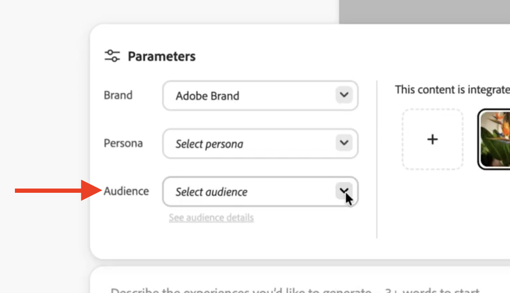
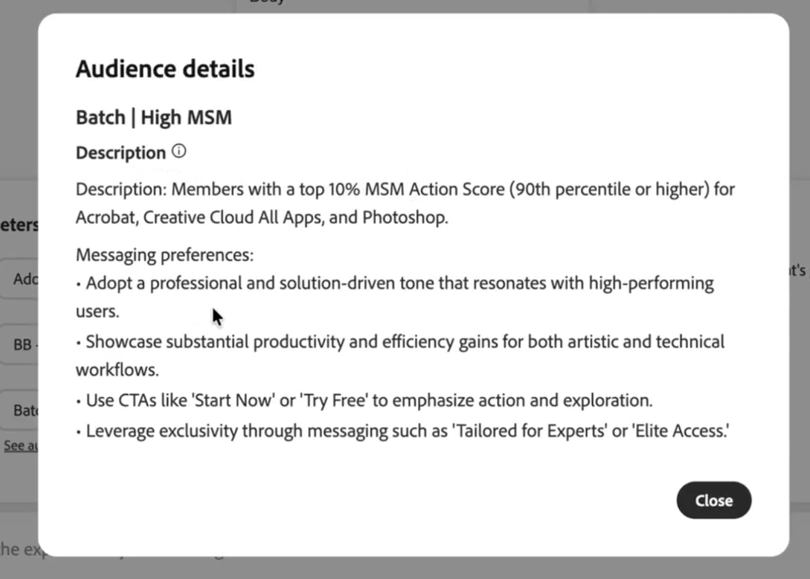

# ガイドラインを追加

GenStudio for Performance Marketingでは、AIが生成したコンテンツがブランドアイデンティティに合わせてカスタマイズされるように、ユーザー定義のガイドラインを設定できます。 このページでは、使用可能な各ガイドラインを設定して使用する手順を説明します。 一般的な説明については、[&#x200B; ガイドラインの概要](/help/user-guide/guidelines/overview.md)を参照してください。

GenStudio for Performance Marketingにガイドラインを追加することは、制作プロセスの重要なステップです。 効果的なアセットを作成するために、ユーザー定義のプロンプト、[&#x200B; アクセシビリティとコンテンツの確認](overview.md#compliance)、Adobeの生成AI テクノロジーとともに、コンテンツ制作プロセスに関するガイドラインを提供します。

ガイドラインは、ユーザー定義にするか、デフォルトガイドライン（[default [!DNL Brand]  チャネルガイドライン &#x200B;](/help/user-guide/guidelines/brands.md#default-channel-guidelines)など）として存在させることができます。

事前に定義されたチャネルガイドライン （[!DNL Brands]、[!DNL Personas]、[!DNL Products]など）を使用してテンプレートからバリエーションを作成する場合、これらのガイドラインはバリエーションに適用されます。 必要に応じてそれらを変更できます。

{{in-academy}}

## URLから追加する際のガイダンス

[!DNL GenStudio for Performance Marketing]のURLから[!DNL Brand]、[!DNL Product]または[!DNL Persona]を追加する場合は、以下の情報を考慮してください。

**URL ベースのワークフローの前提条件**:

- Brand Manager以上の権限を持つ&#x200B;**アクティブな[!DNL GenStudio for Performance Marketing] アカウント**&#x200B;があります。
- **URLは一般に公開されています**。 パスワードで保護されたページやログインで保護されたページでは、出力が制限されます。
- **最適な結果を得るには、retailer、リセラー、またはアグリゲーターの代わりに、ブランド独自のweb サイト URL** （ホームページまたは商品/カテゴリーページ）を使用します。

**URL タイプと想定される出力**:

| URL タイプ | 何を期待するか |
| --- | --- |
| ブランドホームページ | ブランドガイドラインを遵守すると、幅広い商品とペルソナをカバーできます。 |
| 製品カテゴリーページ | 製品とペルソナの範囲は、そのページに表示されているカテゴリーです。 |
| キャンペーンランディングページ | ペルソナシグナルは特に有用ですが、ブランド出力は、ブランド全体ではなくキャンペーンを反映する場合があります。 |
| Retailerまたはパートナーページ | このシステムはサードパーティのコンテンツを優先しないため、出力は制限されます。 |
| ゲーテッド/ログイン必須ページ | ページコンテンツは利用できないので、出力は保守的になります。 |

## ブランドを追加

[!DNL Brand]を追加するには、[&#x200B; ブランドガイドをアップロード &#x200B;](#upload-a-brand)、[手動でブランドを作成](#manually-add-brand)するか、[URLからブランドを作成](#creating-a-brand-from-url)します。 ファイルをアップロードするか、ブランドを手動で追加する場合は、ガイドラインを選択し、ブランドの詳細を入力します。 [a [!DNL Brand]](#publish-brand)を[!DNL Content]に公開して、今後のコンテンツ生成で使用できるようにします。

左側のナビゲーション領域で、_共有_ リストから&#x200B;**[!DNL Brands]**&#x200B;をクリックします。

{width="650" zoomable="yes"}

英語以外の言語で作成されたブランドガイドラインをアップロードするか、英語以外の言語を使用して手作業でブランドを作成すると、GenStudio for Performance Marketingには同じ言語でブランドガイドラインが表示されます。

>[!TIP]
>
>各ブランドは、階層的な関係なしに独立して運営されます。 親ブランドの下にサブブランドを作成するには、作成プロセスに親ブランドの情報を含めます。

### ブランドのアップロード

最大3つのPDFまたはDOC ファイルを含む、独自のブランドガイドラインドキュメントをGenStudio for Performance Marketingにアップロードすると、自動的にブランドが作成されます。

[[!DNL Brands]](/help/user-guide/guidelines/brands.md) を参照してください。

**ブランドドキュメントをアップロードするには**:

1. _[!DNL Brands]_&#x200B;パネルで、「**[!UICONTROL ブランドを追加]**」ボタンを選択します。
1. **[!UICONTROL PDFをアップロード]**&#x200B;を選択し、_ブランド名を入力して、ブランドを追加する方法を選択_ ポップアップを表示します。
1. 「**[!UICONTROL 続行]**」を選択します。
1. ブランドガイドラインのドキュメントを参照して、_[!UICONTROL ブランドを追加]_ ポップアップに添付またはドラッグします。

   最大5つのPDF ファイルを最大500 MBまで添付できます。

1. 「**[!UICONTROL ブランドを追加]**」を選択します。

   Adobeの生成AI テクノロジーを使用して、GenStudio for Performance Marketingはアップロードされたドキュメントから情報を抽出し、ブランドの構築を開始します。 ブランドドキュメントから各ガイドラインを組み立てるたびに、ブランドボイス、チャネル、画像のガイドラインなどのブランド情報が表示されます。

新しいブランドのビューが開き、ドキュメントから抽出されたブランドガイドラインの詳細が表示されます。 ポップアップが表示され、_「ブランドをレビューする準備ができました」_&#x200B;と通知され、抽出したコンテンツをレビューして必要な編集を行うように促されます。

### ブランドを手動で追加

既存のブランドドキュメントをアップロードする代わりに、ブランドの詳細を手動で追加して、新しい[&#x200B; ブランド &#x200B;](brands.md)を入力できます。

**ブランドを手動で追加するには**:

1. 「**[!UICONTROL ブランドを追加]**」ボタンを選択します。
1. **[!UICONTROL 手動でアップロード]**&#x200B;を選択し、_ブランド名を入力して、ブランドを追加する方法を選択_ ポップアップを表示します。
1. 「**[!UICONTROL ブランドを追加]**」を選択します。

   新しい空白のブランドが作成され、表示されます。

1. さまざまなブランド情報、ガイドライン、画像を入力して、適切なセクション（上部のタブビュー）でブランドを構築します。

   新しいブランドのホームページビュー&#x200B;_または_&#x200B;から直接ガイドラインを追加し、上部の個々のタブ付きセクション（参考になる&#x200B;_ビューの例_&#x200B;のツールヒントを含む）に追加できます。

   {width="600" zoomable="yes"}

   - _このブランドを使用するタイミング_:「**[!UICONTROL 追加]**」をクリックするか、テキストフィールドをクリックして既存のテキストを変更し、ブランドに関する概要と使用状況の情報を入力します。 「**[!UICONTROL 変更を保存]**」をクリックします。
   - [_[!DNL Brand]音声ガイドライン _](brands.md#brand-voice-guidelines)：各ガイドライン フィールドに該当する情報を追加します。

     ![音声ガイドライン [!DNL Brand]を追加](/help/assets/brand-voice-add.png){width="500" zoomable="yes"}

   - [_画像ガイドライン_](brands.md#image-guidelines):「**[!UICONTROL カテゴリを追加]**」をクリックして、「一般的なアートガイドライン」や「製品写真」などのガイドラインのカテゴリを追加します。 追加された各カテゴリーにガイドラインを設定します。
   - [_チャネルガイドライン_](brands.md#channel-guidelines)：使用可能な各チャネルをクリックし、適切なガイドラインを追加します。
   - [_ロゴ_](brands.md#logos):「**[!UICONTROL ロゴを追加]**」をクリックしてドラッグ&amp;ドロップするか、参照してロゴをアップロードします。
   - [_カラー_](brands.md#colors):「**[!UICONTROL カラーを追加]**」をクリックして、16進数またはRGBのカラーコード、またはカラーピッカーを使用して個々のカラーを追加します。

     {width="600" zoomable="yes"}

作成した[!DNL Brands]を表示するには、_[!UICONTROL ブランド]_ パネルの上部にある後方矢印をクリックして、_[!UICONTROL ブランド]_ ホームに戻ります。

情報にアクセスするために[!DNL Brand]を[公開](#publish-brand)する必要はありません。 手動で追加された情報は、追加後すぐに使用できます。 組織内の他のユーザーがGenStudio for Performance Marketingで[!DNL Brand]情報を使用するには、公開する必要があります。 作成された[!DNL Brand]は、公開されるまでドラフト形式です。

### URLからのブランドの作成

**前提条件：** URL ベースのワークフローの[前提条件](#prerequisites-for-url-based-workflows)を参照してください。 異なるURLが結果に与える影響については、[URL タイプと想定される出力](#url-types-and-expected-output)を参照してください。

**URLからブランドを作成するには：**

1. GenStudioの&#x200B;**[!DNL Brands]**&#x200B;に移動し、「**[!UICONTROL +ブランドを追加]**」ボタンをクリックします。
1. _ブランドを追加する方法を選択_&#x200B;するよう求められたら、**[!UICONTROL URL]**&#x200B;を使用して選択します。
1. 指定されたフィールドにブランドのURLを入力します。
1. ページを読み取り、ブランドガイドラインを自動的に生成します。このプロセスには通常、1分以内かかります。
1. 生成されたブランドガイドラインカードを確認し、必要に応じてフィールドを編集します。
1. 「**[!UICONTROL 保存]**」をクリックします。 ブランドはコンテンツ生成に利用できるようになりました。

### ブランドサムネールを変更

[!DNL Brand]を手動で追加した後、サムネール画像を変更して、[!DNL Brands] リスト内で簡単に識別できるようにすることができます。

[!DNL Brand]が（手動で追加するのではなく）ドキュメント抽出で作成された場合、それらのドキュメント内の使用可能なロゴがサムネール画像として自動的に実装されます。

**[!DNL Brand]**&#x200B;のサムネール画像を手動で変更します。

1. アクションメニューから「**[!UICONTROL サムネールを変更]**」を選択します。
1. 「_アップロード_」タブで新しい画像をアップロードします。
1. _[!UICONTROL サムネールの変更]_&#x200B;で、アップロードした画像を変更します。
1. **[!UICONTROL 更新]**&#x200B;を選択して、画像を[!DNL Brand] サムネール画像として保存します。

[!DNL Brand]の[!UICONTROL &#x200B; ロゴ &#x200B;] タブビューで、既存の[!DNL Brand] ロゴを選択できます。 クリックしてロゴを開き、アクションメニューから「**[!UICONTROL ブランドサムネールとして使用]**」を選択します。

### ブランドを公開

[!DNL Brand] ドラフトを公開する前に、すべてのガイドライン セクションをクリックして、入力されたすべての情報を確認します。 必要に応じてブランドガイドラインを変更します。

_[!DNL Brands]_&#x200B;では、ドラフトまたは公開された[!DNL Brands]はすべてタイルとして表示されます。 ステータスバッジ（_&#x200B;公開済み&#x200B;_または_ ドラフト _）と、ブランドが最後に変更された時刻が各タイルの下部に表示されます。

>[!TIP]
>
>作成したブランドのみを表示する場合は、[!DNL Brands] フィルター（&lbrace;funnel アイコン）から「**[!UICONTROL 自分が作成したブランド]**」を選択します。

**ブランドドラフトを公開するには**:

1. 左側のナビゲーション領域で、**[!UICONTROL [!DNL Brands]]**&#x200B;をクリックします。
1. サムネールタイルをクリックして、既存の[!DNL Brand] ドラフトを開きます。
1. 「**[!UICONTROL 公開]**」ボタンをクリックします（ドラフトでのみ使用できます）。
1. _ブランドを公開_ ポップアップで、公開された[!DNL Brand]を表示および使用するアクセス権を持つユーザーを確認します。
1. 表示される&#x200B;_Publish brand_ ポップアップで、**[!UICONTROL Publish]**&#x200B;を選択します。

   ポップアップで、[!DNL brand]が公開されていることを確認します – 「{Brand}が準備できました」。

1. 「**[!UICONTROL 完了]**」をクリックしてポップアップを終了します。

[!DNL brand]には、名前の横に緑色のドットと「公開済み」が表示され、**[!UICONTROL 公開]** ボタンの代わりに&#x200B;**[!UICONTROL 編集[!DNL brand]]** ボタンが表示されます。

**公開した[!DNL brand]**&#x200B;を非公開にするには、ブランドをクリックして開き、アクションメニュー（3つのドットアイコン）から&#x200B;**[!UICONTROL 非公開]**&#x200B;をクリックします。

公開されたブランドは、[_[!DNL Create]_](/help/user-guide/create/overview.md)および[_[!DNL Content]_](/help/user-guide/content/overview.md)で使用できるようになりました。

### ブランド管理

_[!DNL Brands]_&#x200B;ホームで、既に作成したブランドをクリックして開き、管理または公開できます。

ブランド情報を&#x200B;**表示**&#x200B;するには、左側のナビゲーション領域の&#x200B;**[!UICONTROL [!DNL Brands]]**&#x200B;をクリックし、クリックして既存のブランドを開きます。

**[!DNL Brands] ビューでブランド**&#x200B;を変更するには：

1. **[!DNL Brands]**&#x200B;で、クリックして定義済みのブランドを開きます。
1. 個々の詳細を表示したり、ガイドラインを変更したりするには、上部の[**[!UICONTROL &#x200B; ブランドボイスガイドライン &#x200B;]**](brands.md#brand-voice-guidelines)、[**[!UICONTROL 画像ガイドライン &#x200B;]**](brands.md#image-guidelines)、[**[!UICONTROL &#x200B; チャネルガイドライン &#x200B;]**](brands.md#channel-guidelines)、[**[!UICONTROL &#x200B; ロゴ &#x200B;]**](brands.md#logos)、または[**[!DNL Colors]**](brands.md#colors)をクリックします。
1. ブランドロゴを管理するには、上部の[**[!UICONTROL &#x200B; ロゴ &#x200B;]**](brands.md#logos)をクリックし、アクションメニュー（3つのドット）をクリックします。
   1. **[!UICONTROL 詳細を表示]**&#x200B;を選択して、_形式_&#x200B;や&#x200B;_サイズ_&#x200B;など、[!DNL Brand]の情報を表示します。
   1. 「**[!UICONTROL ダウンロード]**」を選択して、ロゴをダウンロードします。
   1. [**[!UICONTROL &#x200B; ブランドサムネールとして使用]](#change-brand-thumbnail)を選択して、ロゴをサムネール画像として設定します。
   1. 「**[!UICONTROL 名前を変更]**」を選択して、ロゴの名前を変更します。
   1. 「**[!UICONTROL 削除]**」を選択して、ロゴを削除します。
1. 既存のブランドの名前を変更するには、タイトルをクリックして新しいタイトルを入力します。
1. 既存のブランドを複製するには、_[!DNL Brands]_&#x200B;アクションメニューから「**[!UICONTROL 複製]**」を選択します。
   1. 「_ブランドを複製_」ポップアップにブランド名を入力し、「**[!UICONTROL ブランドを複製]**」をクリックします。

      ポップアップは、ブランドが複製されていることを確認します。「新しいブランドが作成されました」 重複したブランドは、最初は&#x200B;_未公開_ モードです。

   1. 複製したブランドをカスタマイズしてから[公開し](#publish-brand)使用できるようにします。
1. ブランドを削除するには、[!DNL Brands] アクションメニューから&#x200B;**[!UICONTROL 削除]**&#x200B;を選択します。

## [!DNL Personas] の追加

ペルソナを追加するには、[&#x200B; ペルソナをアップロード &#x200B;](#upload-a-persona)、[手動でペルソナを作成](#manually-add-persona)、または[URLからペルソナを追加](#adding-personas-from-url)。 ファイルをアップロードするか、ペルソナを手動で追加する場合は、「ガイドライン」を選択し、ペルソナの詳細を入力します。

左側のナビゲーション領域で、_共有_ リストから&#x200B;**[!DNL Personas]**&#x200B;をクリックします。

{width="650" zoomable="yes"}

GenStudio for Performance Marketingに[!DNL Persona]を追加すると、作成したコンテンツを理想的なオーディエンスにターゲティングできます。

[[!DNL Personas]](personas.md) を参照してください。

### ペルソナのアップロード

独自のペルソナドキュメントをアップロードして、新しいペルソナを作成できます。

[[!DNL Personas]](/help/user-guide/guidelines/personas.md) を参照してください。

1. _[!DNL Personas]_&#x200B;パネルで、「**[!UICONTROL ペルソナを追加]**」ボタンを選択します。
1. **[!UICONTROL ファイルをアップロード]**&#x200B;を選択し、_にペルソナ名を入力して、ペルソナを追加する方法を選択_ ポップアップを表示します。
1. 「**[!UICONTROL 続行]**」を選択します。
1. ペルソナ ガイドライン ドキュメントを参照して、_[!UICONTROL ペルソナを追加]_ ポップアップに添付またはドラッグします。

   最大5つのPDFまたはDOC ファイルを最大500 MBまで添付できます。

1. 「**[!UICONTROL ペルソナを追加]**」を選択します。

   Adobeの生成AI テクノロジーを使用して、GenStudio for Performance Marketingはアップロードされたドキュメントから情報を抽出し、ペルソナの作成を開始します。 ペルソナドキュメントの各ガイドラインを組み立てると、ペルソナの声、チャネル、画像のガイドラインなどの詳細が表示されます。

   新しいペルソナのビューが開き、ドキュメントから抽出されたペルソナガイドラインの詳細が表示されます。 ポップアップが表示され、_「お客様のペルソナをレビューする準備ができました」_&#x200B;と通知され、抽出したコンテンツをレビューして必要な編集を行うように促されます。

### ペルソナを手動で追加

既存のペルソナドキュメントをアップロードする代わりに、ペルソナの詳細を手動で追加して、新しい[&#x200B; ペルソナ &#x200B;](personas.md)を入力できます。

**ペルソナを手動で追加するには**:

1. 「**[!UICONTROL ペルソナを追加]**」ボタンを選択し、**[!UICONTROL 手動で追加]**&#x200B;を選択します。
1. 「**[!UICONTROL 続行]**」をクリックします。

   様々なオプションガイドラインと画像を入力して、ペルソナを構築できます。

1. **[!UICONTROL 新しいペルソナ名]**&#x200B;をクリックし、[!DNL Persona]の名前を入力します。
1. [!DNL Persona]に関する情報を&#x200B;_説明_ セクションに追加します。

   ![[!DNL Persona]](/help/assets/personas-add.png){width="650" zoomable="yes"}を追加

1. 「_説明_」をクリックして、この[!DNL Persona]の説明を入力します。
1. _メッセージ設定_&#x200B;をクリックし、[!DNL Persona]のメッセージの詳細を入力します。
1. サムネールを編集するには、画像のサムネールにカーソルを合わせ、アクションメニューから「**[!UICONTROL サムネールを編集]**」を選択します。
   1. _ギャラリー_ タブ _または_&#x200B;のギャラリーから画像を選択し、_アップロード_ タブに新しい画像をアップロードします。

      _アップロード_ タブで、既存のサムネール画像を削除または切り抜くこともできます。

   1. 「**[!UICONTROL 画像を使用]**」をクリックします。
1. カバー画像を編集するには、カバーにカーソルを合わせ、アクションメニューから「**[!UICONTROL カバーを編集]**」を選択します。
   1. _ギャラリー_ タブ _または_&#x200B;のギャラリーから画像を選択し、_アップロード_ タブに新しい画像をアップロードします。
   1. 「**[!UICONTROL 画像を使用]**」をクリックします。
   1. カバー画像の位置を変更するには、アクションメニューから「**[!UICONTROL 再配置]**」をクリックし、画像を目的の位置にドラッグして「**[!UICONTROL 保存]**」をクリックします。

   作成した[!DNL Personas]を表示するには、_ペルソナ_ ビューの上部にある後方矢印をクリックして、_[!DNL Personas]_&#x200B;ホームに戻ります。

### URLから[!DNL Personas]を追加

**前提条件：** URL ベースのワークフローの[前提条件](#prerequisites-for-url-based-workflows)を参照してください。 異なるURLが結果に与える影響については、[URL タイプと想定される出力](#url-types-and-expected-output)を参照してください。

**URLからペルソナを追加するには：**

1. GenStudioの&#x200B;**[!DNL Personas]**&#x200B;に移動し、「**[!UICONTROL +ペルソナを追加]**」ボタンをクリックします。
1. _ペルソナを追加する方法を選択_&#x200B;するよう求められたら、**[!UICONTROL URL]**&#x200B;経由で選択します。
1. 指定されたフィールドにブランドのURLを入力します。
1. ページから表示されたオーディエンスセグメントのリストを確認します。 適用されないセグメントを削除し、必要に応じて名前を変更して、見つからないセグメントを追加します。
1. リストを確認する： 確認された各セグメントに対して、完全なペルソナカードの生成が開始されます。
1. ペルソナカードは、完了時にライブラリに表示されます。 コンテンツ生成で使用する前に、各ペルソナを確認し、編集します。

### [!DNL Personas]を管理

_[!DNL Personas]_&#x200B;ホームでは、既に作成した&#x200B;[!DNL Persona]&#x200B;**を**&#x200B;開いて編集またはレビューするか、リストから&#x200B;**ペルソナを削除**&#x200B;できます。

- [!DNL Personas] アクションメニューから「**[!UICONTROL 開く]**」を選択して、既存のペルソナを修正およびレビューします。
- [!DNL Personas] アクションメニューから&#x200B;**[!UICONTROL 削除]**&#x200B;を選択し、ペルソナを&#x200B;**削除**&#x200B;します。
- 「[!DNL Personas]」アクションメニューから「**[!UICONTROL 名前を変更]**」を選択し、**ペルソナの名前を変更**&#x200B;します。

## [!DNL Products] の追加

製品を追加するには：

1. 左側のナビゲーション領域で、_共有_ リストから&#x200B;**[!DNL Products]**&#x200B;をクリックします。
   {width="650" zoomable="yes"}
1. _[!DNL Products]_&#x200B;パネルで、**[!UICONTROL 製品を追加]**&#x200B;を選択します。
1. [製品をアップロード &#x200B;](#upload-a-product)、[製品を手動で作成](#manually-add-a-product)、または[製品をURL](#adding-products-from-url)から追加することを選択します。 ファイルをアップロードするか、製品を手動で追加する場合は、「ガイドライン」を選択し、製品の詳細を入力します。

![[!DNL Product]](/help/assets/products-add.png){width="650" zoomable="yes"}を追加

GenStudio for Performance Marketingに[!DNL Product]を含めると、特定の商品に合わせて作成するコンテンツをより適切に調整できます。

[[!DNL Products]](products.md) を参照してください。

### 製品のアップロード

独自の商品ドキュメントをアップロードして、新しい商品を追加できます。

[[!DNL Products]](/help/user-guide/guidelines/products.md) を参照してください。

1. 「**[!UICONTROL 製品を追加]**」ボタンを選択します。
1. **[!UICONTROL ファイルをアップロード]**&#x200B;を選択し、_製品を追加する方法を選択_ ポップアップに製品名を入力します。
1. 「**[!UICONTROL 続行]**」を選択します。
1. 商品ガイドラインドキュメントを参照して、製品を追加&#x200B;_[!UICONTROL ポップアップに添付またはドラッグします。]_

   最大5つのPDFまたはDOC ファイルを最大500 MBまで添付できます。

1. 「**[!UICONTROL 製品を追加]**」を選択します。

   Adobeの生成AIを利用して、GenStudio for Performance Marketingがアップロードしたドキュメントを分析し、商品プロファイルを構築します。 製品ドキュメントの各ガイドラインが処理されると、製品の説明、価値提案、メッセージの好みなどの情報が表示されます。

   新しい製品のビューが開き、ドキュメントから抽出された製品ガイドラインの詳細が表示されます。 ポップアップで「_」製品のレビュー準備が完了しました。「_」と通知され、抽出したコンテンツのレビューと必要な編集を行うように促されます。

### 製品の手動追加

既存の製品ドキュメントをアップロードする代わりに、製品の詳細を手動で追加して、新しい[製品](products.md)を入力できます。

**製品を手動で追加するには**:

1. 「**[!UICONTROL 製品を追加]**」ボタンを選択し、**[!UICONTROL 手動で追加]**&#x200B;を選択します。
1. 「**[!UICONTROL 続行]**」をクリックします。

   さまざまなオプション情報を入力して、製品を構築できます。

1. **[!UICONTROL 新製品名]**&#x200B;をクリックし、[!DNL product]の名前を入力します。
1. [!DNL product]に関する情報を&#x200B;_説明_ セクションに追加します。
1. 「_説明_」をクリックして、この[!DNL Product]の説明を入力します。
1. _価値提案_&#x200B;をクリックし、価値提案の詳細を入力して[!DNL Product]を正しく配置します。
1. _メッセージ設定_&#x200B;をクリックし、[!DNL product]のメッセージの詳細を入力します。
1. サムネールを編集するには、画像のサムネールにカーソルを合わせ、アクションメニューから「**[!UICONTROL サムネールを編集]**」を選択します。
   1. _ギャラリー_ タブ _または_&#x200B;のギャラリーから画像を選択し、_アップロード_ タブに新しい画像をアップロードします。

      _アップロード_ タブで、既存のサムネール画像を削除または切り抜くこともできます。

   1. 「**[!UICONTROL 画像を使用]**」をクリックします。
   1. カバー画像を編集するには、カバーにカーソルを合わせ、アクションメニューから「**[!UICONTROL カバーを編集]**」を選択します。
   1. _ギャラリー_ タブ _または_&#x200B;のギャラリーから画像を選択し、_アップロード_ タブに新しい画像をアップロードします。
   1. 「**[!UICONTROL 画像を使用]**」をクリックします。
   1. カバー画像の位置を変更するには、アクションメニューから「**[!UICONTROL 再配置]**」をクリックし、画像を目的の位置にドラッグして「**[!UICONTROL 保存]**」をクリックします。

   作成した[!DNL Products]を表示するには、_製品_ ビューの上部にある後方矢印をクリックして、_[!DNL Products]_&#x200B;ホームに戻ります。

### URLからの商品の追加

**前提条件：** URL ベースのワークフローの[前提条件](#prerequisites-for-url-based-workflows)を参照してください。 異なるURLが結果に与える影響については、[URL タイプと想定される出力](#url-types-and-expected-output)を参照してください。

**URL**&#x200B;から[!DNL Products]を追加するには

1. GenStudioの&#x200B;**[!DNL Products]**&#x200B;に移動し、「**[!UICONTROL +製品を追加]**」ボタンをクリックします。
1. _製品を追加する方法を選択_&#x200B;するよう求められたら、**[!UICONTROL URL]**&#x200B;経由で選択します。
1. URLを入力します。 ブランドのホームページで幅広い商品リストを検索するか、カテゴリーページで検索結果を絞り込みます。
1. ページから表示された製品のリストを確認します。 属していない項目を削除し、必要に応じて名前を変更して、不足している製品を追加します。
1. リストを確認する： 確認された各製品の完全な製品詳細の生成が開始されます。
1. 商品がライブラリに表示されます。 コンテンツ生成で各製品を使用する前に、レビューし、編集します。

### [!DNL Products]を管理

_[!DNL Products]_&#x200B;ホームでは、既に作成した&#x200B;[!DNL Product]&#x200B;**を**&#x200B;開いて編集またはレビューするか、リストから&#x200B;**製品**&#x200B;を削除できます。

- [!DNL Products] アクションメニューから「**[!UICONTROL 開く]**」を選択して、既存の製品を修正およびレビューします。
- [!DNL Products] アクションメニューから&#x200B;**[!UICONTROL 削除]**&#x200B;を選択して、製品を&#x200B;**削除**&#x200B;します。
- 「[!DNL Products]」アクションメニューから「**[!UICONTROL 名前を変更]**」を選択し、製品の「**名前を変更**」を選択します。

## [!DNL Audiences] の追加

>[!NOTE]
>
>[!DNL Audiences]機能を利用するには、GenStudioにAdobe チームがオンボーディングする必要があります。 テンプレートパラメーターに&#x200B;_[!DNL Audiences]_&#x200B;が表示されない場合は、Adobe担当者にお問い合わせください。

[!DNL Audiences]は、Adobe Real-Time Customer Data Platform （RTCDP）からターゲットを絞った顧客セグメントを提供し、正確なターゲティングデータをコンテンツ生成ワークフローに取り込みます。 GenStudio for Performance Marketingでは、オーディエンスの定義を活用して、特定の顧客セグメントに合わせたマーケティングコンテンツを制作できます。

[!DNL Audiences]は、[&#x200B; ワークフロー&#x200B;_[!DNL Create]_&#x200B;のパラメーターペインにドロップダウンとして表示されます](../create/overview.md#templates)。_[!DNL Audiences]_&#x200B;は、両方のガイドラインを使用する場合に&#x200B;_[!DNL Personas]_&#x200B;に特異性を追加できますが、単独で効果的に使用することもできます。

オンボーディング中に、オーディエンス定義が読み込まれ、GenStudioと互換性のあるフォーマットに変換されます。 通常、このプロセスは完了するのに数日かかります。 Adobeチームに連絡して開始してください。

**前提条件**:

- Adobe Real-Time Customer Data Platformへのアクセス
- RTCDP サンドボックスですでに設定されている既存のオーディエンス
- _[!DNL Audience]_&#x200B;統合には、Adobe チームによる手動オンボーディングプロセスが必要です

**オーディエンスを選択するには**:

1. [&#x200B; ワークフロー&#x200B;_[!DNL Create]_&#x200B;でテンプレートを選択し、**[!UICONTROL 使用]**&#x200B;ボタンをクリックしてドラフトを開きます。](../create/overview.md#templates)
1. パラメーターリストで、_[!UICONTROL Audience]_ ドロップダウンをクリックして、使用可能なすべてのオーディエンスを表示します。
   ペルソナのパラメーターペインの{width=450}
1. リストから割り当てるオーディエンスを選択します。 [!DNL Persona]が選択されている場合、システムは、選択した[!DNL Persona]に一致する推奨オーディエンスを提案します。
1. 「**[!UICONTROL オーディエンスの詳細を表示]**」をクリックして、選択したオーディエンスに対して生成された拡張された説明とメッセージの環境設定を表示します。 オーディエンスの詳細がコンテンツの生成に反映されるため、クリエイティブがターゲットセグメントの特定の特性や好みに即していることを確認できます。
   {width=450}
