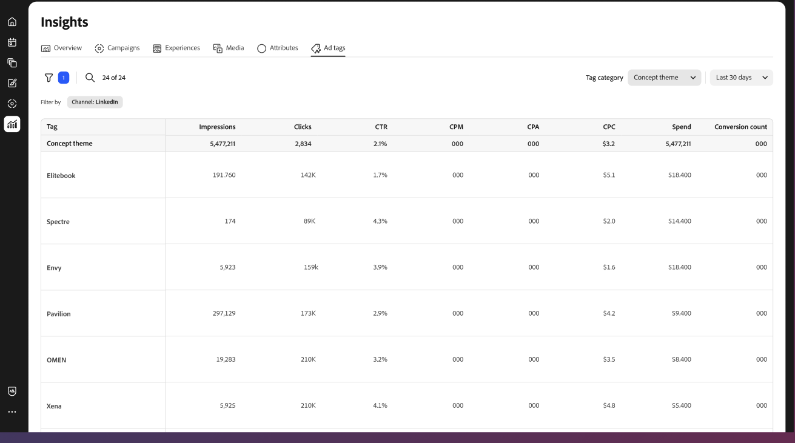

# 広告タグの概要

[!DNL Insights] _[!UICONTROL 広告タグ]_ ビューには、接続されたチャネルとアカウントの広告のリストが表示されます。 _ad_&#x200B;は、マーケティングキャンペーンの一環として特定のオーディエンスに配信することを目的とした、視覚的でインタラクティブなコンテンツを含むプロモーションアセットです。

{{connect-insights}}

_[!UICONTROL 広告タグ]_ テーブルは、[!UICONTROL 広告名]を使用して整理されています。 表の右側にある設定（歯車）アイコンをクリックして、表示可能な列を切り替えます。

_[!UICONTROL 広告タグ]_ ギャラリービューには、広告プレビューのコラージュと、クリック率などの指標が表示されます。 ギャラリーの右側にある設定（歯車）アイコンをクリックして、**[!UICONTROL カード設定]**&#x200B;を開き、3つの表示可能な指標のいずれかを切り替えます。

- CPA （アクション単価）
- CTR （クリックスルー率）
- CPC （クリック単価）
- 費用

{{filter-table}}
