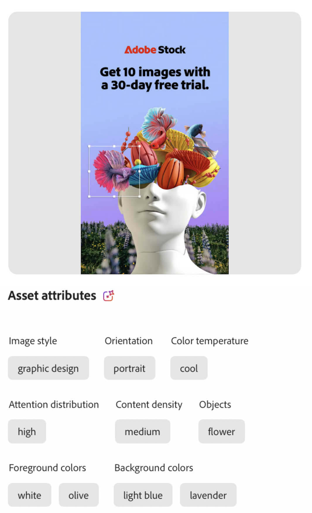

# 属性カテゴリ

属性カテゴリは、共通の特性を共有する関連属性を整理する分類グループです。 これらのカテゴリは、より詳細なコンテキストを提供し、それらのアプリケーションと使用を容易にすることで、特定の属性の検出、識別、理解を合理化するのに役立ちます。

GenStudio for Performance Marketingは、Adobeの AI および機械学習機能を使用して、画像、ビデオおよびテキストを調査し、信頼性のレベルに基づいて [!UICONTROL  アセット属性 ] を適用します。 _信頼性_ とは、AI が予測または分類に割り当てる確率を指します。 機械学習のコンテキストでは、分類が正しいという AI の「自信」を測定する一種のスコアリングです。 信頼性スコアリングが高いほど、確実性が高くなります。 例えば、画像を分析する際に、AI は複数の機能を識別し、それぞれにスコアを割り当てて、その機能が正しいことの信頼性を示す場合があります。 アセットの属性リストは完全なものではありません。 豊富な機能セットを含むAssetsは、特定された 3 つの最も支配的な機能など、信頼性のしきい値に制限される場合があります。

## 画像機能

画像の特徴は、[!DNL Insights] での分析に使用される、画像内の個別のわかりやすい要素やパターンを表します。 次の表に、GenStudio for Performance Marketing AI で認識される画像の機能カテゴリを示します。

<!-- For the writer: turn off word wrap to work with these tables. Option + Z -->

| カテゴリ | 説明 | 例 |
| ----------------------- | ----------------------------------------------------------------------------------------------------- | ------------------------------------------------------------------------------------------------------------------------------------------------------------------------------ |
| カメラアングル | 被写体に対するカメラの位置と角度。 |                                                                                                                                                                                |
| 被写体距離 | カメラと画像の被写体との間の距離。 | `close up`、`mid shot`、`long shot` |
| カメラ設定 | 画像を生成するためのカメラのコントロールの設定。 |                                                                                                                                                                                |
| カラーとトーン | 画像要素で使用されるカラーを評価します。 次の画像レイヤーにある 40 色のセットから 1～3 色を識別します。 **[!UICONTROL  前景色 ]**– 画像の前面レイヤーの要素  **[!UICONTROL  背景色]** – 画像の背面レイヤーの要素
**[!UICONTROL 色温度]** は、画像内の色の一般的な暖かさや涼しさを表します。  トーンまたは温度の値：`warm`、`cool`、`neutral` | {width="200" zoomable="yes"} |
| 画像スタイル | 画像の視覚的処理。 |                                                                                                                                                                                |
| 照明条件 | イメージ内のライトのタイプ。 |                                                                                                                                                                                |
| オブジェクト | 画像を構成する 1 つ以上の項目、エンティティ、要素を識別します。 | {width="200" zoomable="yes"} |
| オリエンテーション | 縦横比に対する画像の位置。 | `landscape`、`portrait`、`square` |
| ユーザー | 1 人以上の人物が存在する場合、1 つ以上の属性がその人物または画像内の人物を説明できます。 | {width="200" zoomable="yes"} |
| 写真ジャンル | 画像のキャプチャに使用する被写体やテクニックを検出します（例：`abstract` または `landscape`）（横向きと同じではありません）。 |           |
| シーン | イメージに表示される設定または環境を検出します。 |                                             |
| タグ | 特定の分類に該当しないオブジェクト、要素、その他の画像特性を検出します。 |                                      |

<!-- Not yet approved by legal
| Attention distribution  | The level of viewer attention spread across an image.                                                 | `high`, `medium`, `low`                                                                                                                                                                                                    |
| Content density         | The amount of information or detail in an image.                                                      | `high`, `medium`, `low`                                                                                                                                                                                                    |
-->

## ビデオ機能

画像特性は、[!DNL Insights] で分析するために、ビデオ内の個別のわかりやすい要素、サウンドまたはパターンを表します。 次の表に、GenStudio for Performance Marketing AI で認識されるビデオ機能カテゴリを示します。

| カテゴリ | 説明 | 例 |
| ------------------- | ------------------------------------------------------------------------------------------------------------ | --------------------------------------------------------------------------------------- |
| オーディオジャンル | 音楽が存在する場合、ビデオは `electronic` や `classical` などの音楽スタイルの 1 つの分類を受け取る場合があります。 |          |
| オーディオジャンルのカテゴリ | 音楽が存在する場合、ビデオは `acoustic` や `traditional` など、音楽ジャンルの幅広い分類を 1 つ受け取る場合があります。 |          |
| オーディオムード | `relaxing` や `energetic` など、オーディオの一般的な雰囲気やトーンを表します。 |          |
| 音声タイプ | オーディオが存在する場合、ビデオは、1 つ以上のオーディオタイプ（`music` や `speech` など）のタグを受け取る場合があります。 |          |
| オブジェクト | ビデオ全体に表示される 1 つ以上の項目、エンティティ、要素を識別します。 | {width="200" zoomable="yes"} |
| オリエンテーション | フレームの縦横比に対するビデオの位置。 | `landscape`、`portrait`、`square` |
| ユーザー | 少なくとも 1 人のユーザーが存在する場合、1 つ以上の属性がそのユーザーまたはユーザーをビデオで説明できます。 |        |
| シーン | ビデオに示されている設定または環境。 |        |
| スタイル | ビデオ内の要素に適用された視覚的処理（`matte` や `neon` など）を検出します。 |        |
| タグ | 特定の分類に該当しないオブジェクト、要素、その他のビデオ特性を検出します。 |        |

## テキスト機能

テキスト機能には、単語、文、絵文字などの特定のテキスト要素のカウントや、[!DNL Insights] での分析に使用されるセマンティクス、感情、トーンの分類が含まれます。 テキストは、読みやすさのスコアが得られる場合もあります。 準備中

<!-- Not yet approved by legal

The following table lists the image feature categories recognized by the GenStudio for Performance Marketing AI.

| Category             | Description | Example |
|----------------------|-------------|--------|
| Emojis Count         |             |        |
| HashTags Count       |             |        |
| Keywords             |             |        |
| Marketing Emotions   |             |        |
| Narratives           | Text that represents an overarching situation, theme, or a story. Narratives can communicate values, purpose, or identity that resonates with consumers on many levels.   |        |
| Persuasion Strategies|             |        |
| Readability          |             |        |
| Tone of voice        | | |
-->
