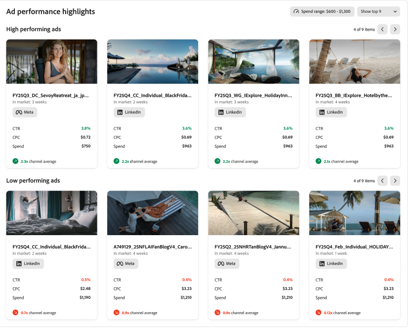

# Adobe GenStudio for Performance Marketing Insights

Adobe GenStudio for Performance Marketing [!DNL Insights] は、データに基づいた決定を支援できるコンテンツパフォーマンスに関する高度な分析とインサイトを提供します。

[!DNL Insights] ダッシュボードから、次の操作を実行できます。

- **最も効果的なコンテンツを特定**：様々なオーディエンスにに対してパフォーマンスが最も高いコンテンツを特定し、トレンドの好みに合わせて今後のコンテンツやキャンペーンを調整します。
- **パフォーマンスの低いコンテンツを最適化**：パフォーマンスの低いコンテンツを見つけ、統合された生成 AI を使用してバリエーションをすぐに作成すると、ゼロから開始することなく、その効果を向上させることができます。
- **パフォーマンスの高いコンテンツを再活性化**：成功しているコンテンツを利用し、調整して、オーディエンス向けに更新したり、ヒーローコンテンツを新しいキャンペーン用に適応させたりすると、そのライフサイクルやパフォーマンスをさらに延ばすことができます。

[!DNL Insights] モジュールには、有料ソーシャル向けのクロスチャネルパフォーマンスエクスペリエンスである **[!UICONTROL Insights 2.0]** が含まれています。これは、この記事の[ダッシュボード](#dashboard)の節にある詳細なテーブルおよびギャラリービューと共に機能します。

## Insights 2.0 {#insights-20}

**[!UICONTROL Insights 2.0]** は、接続されたアカウントをまたいで有料ソーシャルマーケティングのパフォーマンスをマーケターが明確に把握できるパフォーマンスインテリジェンスレイヤーを提供します。

**[!UICONTROL Insights 2.0] では、次の操作を実行できます。**

- **クロスチャネルまたはシングルチャネルの概要を確認（Meta および LinkedIn）**：両方の有料ソーシャルチャネルをまたいで統合されたスナップショットを参照したり、1 つのチャネルにドリルダウンしたりします。
- **ククロスチャネルパフォーマンスレポートを使用**：貢献度をパーセンテージで示すビジュアライゼーションを使用して、各チャネルの結果の共有を表示します。これには、合計支出（パーセンテージおよび金額）や、CTR、CPC、CPM などパフォーマンス共有の指標が含まれます。
  
- **広告パフォーマンスレポートを使用**：最適化の決定をサポートするランキングや指標を使用して、パフォーマンスの高い広告と低い広告を特定します。
  
- **Meta コンバージョン指標を分析**：ファネルのステージ（例：エンゲージメント済みの訪問数、情報のリクエスト、アプリの開始、見込み客、アプリの完了）をまたいで CPA を可視化してコンバージョンに焦点を当てて、GenStudio for Performance Marketing で使用可能なコンバージョンデータを使用して、コンバージョントレンドの推移を確認します。
  
- **広告タグからインサイトを探索**：広告トラッキング ID は構造化されたタグに解析されるので、（コールトゥアクション、地域、書式設定、概念など）定義したディメンションでパフォーマンスを分析し、これらのディメンションをまたいで予算配分を参照して、命名規則を手動でデコードする時間を短縮できます。
  

>[!NOTE]
>
>**[!UICONTROL Insights 2.0]** には現在、**Meta** と **LinkedIn** のみが含まれています。現時点では、TikTok、DV360、Innovid は **[!UICONTROL Insights 2.0]** の概要に含まれていません。[ダッシュボード](#dashboard)の節の&#x200B;**[!UICONTROL キャンペーン]**、**[!UICONTROL 広告]**、**[!UICONTROL メディア]**、**[!UICONTROL 属性]**&#x200B;の各ビューは、引き続き[サポートされているチャネル](#channels-supported)で説明されているより広範なチャネルセットをサポートします。

## Data Connectors

初めて [!DNL Insights] を開いた際、Adobe GenStudio for Performance Marketing とチャネルアカウントとの接続をガイドするバナーが表示される場合があります。

この接続により、GenStudio for Performance Marketing は、アクティブなマーケティングキャンペーン、メディア、広告から統計データを受信できます。まず、GenStudio for Performance Marketing は過去 6 か月間のデータを取り込みます。これにより、最新のデータを分析し、アクションを実行するツールを使用できます。

{{connect-insights}}

## サポートされているチャネル {#channels-supported}

Insights でサポートされているチャネルには、Meta、LinkedIn、TikTok、DV360、Innovid が含まれます。

Meta、LinkedIn、TikTok では、キャンペーン、広告、メディア、属性に関する完全な可視性を提供します。DV360 と Innovid は現在、より限定的なデータカバレッジを提供します。

現時点では、DV360 と Innovid のメディアデータは使用できません。これにより、これらのチャネルについては「属性」タブも表示されません。「属性」タブは、エクスペリエンスから抽出された特性を表示するために、メディアレベルのデータに依存しています。

この制限は、有料メディアプラットフォーム自体の制約によるもので、GenStudio for Performance Marketing の問題ではありません。

## ダッシュボード {#dashboard}

[!DNL Insights] ダッシュボードには、[!UICONTROL チャネル]、[!UICONTROL 広告]、[!UICONTROL メディア]、[!UICONTROL 属性]という各コンテンツタイプ用の設定可能なテーブルが用意されています。

![[!DNL Insights] ダッシュボード](/help/assets/insights-dashboard.png)

各ビューには対応するテーブルが表示され、キーワード、フィルタリング、日付範囲で検索できます。テーブルの右上にある設定（歯車）アイコンをクリックすると、表示する列のタイプを切り替えることができます。_[!UICONTROL 概要]_&#x200B;行には、列の合計や平均が表示される場合があります。

[!UICONTROL 広告]、[!UICONTROL メディア]、[!UICONTROL 属性]には、画像やビデオのサムネイル付きカードを使用してアセットをスキャンおよび並べ替えできるギャラリービューが含まれます。各カードに、`Click-through rate`、`Cost per click`、`Spend` という 3 つの主要指標のいずれかを表示するオプションがあります。

### キャンペーン

[[!DNL Insights] _[!UICONTROL  のキャンペーン&#x200B;]_ビュー](campaigns.md)は、デフォルトのビューで、目的、予算、開始日、アクティビティなど、アクティブなキャンペーンの詳細リストを表示します。GenStudio for Performance Marketing が統計データの受信を開始するように、[チャネルアカウントを接続](/help/user-guide/connectors/connect-channel.md)します。

### 公開されたエクスペリエンス

[[!DNL Insights] _[!UICONTROL  の公開されたエクスペリエンスの詳細&#x200B;]_ビュー](published-experiences.md)は、エクスペリエンスの効果を評価することに重点を置いています。[!UICONTROL 公開されたエクスペリエンス]ビューでは、指定した日付範囲内でのエクスペリエンスのプレースメントに基づいて、その指標を分析できます。_[!UICONTROL &#x200B;エクスペリエンス名&#x200B;]_をクリックすると、エクスペリエンスのパフォーマンス指標、プレースメント別のパフォーマンス、属性を表示できます。

### メディア

[[!DNL Insights] _[!UICONTROL  のメディア&#x200B;]_ビュー](media.md)は、クリエイティブコンテンツのパフォーマンスを分析するのに役立つように設計されています。クリック数やインプレッション数など、選択した指標の向上に貢献するメディア属性を特定できます。

メディアコンテンツをクリックすると、様々な広告や広告プレースメントでのそのパフォーマンスに関する詳細な情報が表示されます。

{width="600" zoomable="yes"}

メディアの詳細ビューの左側には、アセットのサムネイルと属性のリストが表示されます。ハイライト表示されている指標には、`Click-through rate`、`Cost per click`、`Spend` の 3 つがあります。パフォーマンスのハイライトでは、選択した期間（デフォルトは `Last 30 days`）の実際の値（実線）と平均値（点線）の比較が表示されます。

### 属性

メディア&#x200B;_属性_&#x200B;は、カラー、トーン、コンポジション（被写体、フォント、ビジュアル要素など）、その他の主要なコンポーネントなど固有の詳細別にクリエイティブコンテンツを識別するのに役立ちます。属性は、多くの場合、最も測定と分析が少ないコンテンツ情報のセットです。

[[!DNL Insights] _[!UICONTROL  の属性&#x200B;]_ビュー](attributes.md)を使用すると、特定のオーディエンス、チャネル、地域でパフォーマンスが高い属性を調査および特定し、季節ごとのトレンドをハイライト表示できます。これらのインサイトを使用すると、パフォーマンスが高い属性を使用して、バリアントを作成したり、特定のオーディエンスをターゲットにしたり、異なるキャンペーン戦略で実験したりできます。

### 広告タグ

[[!DNL Insights] _[!UICONTROL  の広告タグ&#x200B;]_ビュー](ad-tags.md)には、接続されたチャネルの広告アカウントの広告リストが表示されます。_&#x200B;広告&#x200B;_とは、マーケティングキャンペーンの一部として特定のオーディエンスに配信することを目的とした、ビジュアルやインタラクティブコンテンツを含むプロモーションアセットです。
