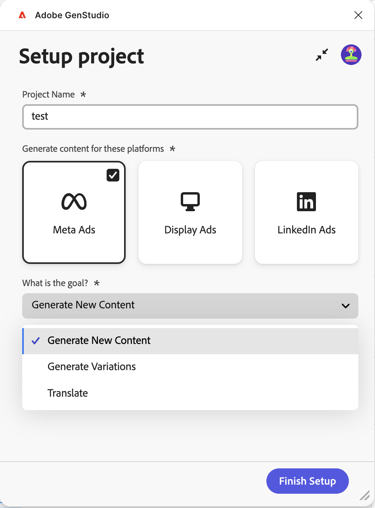
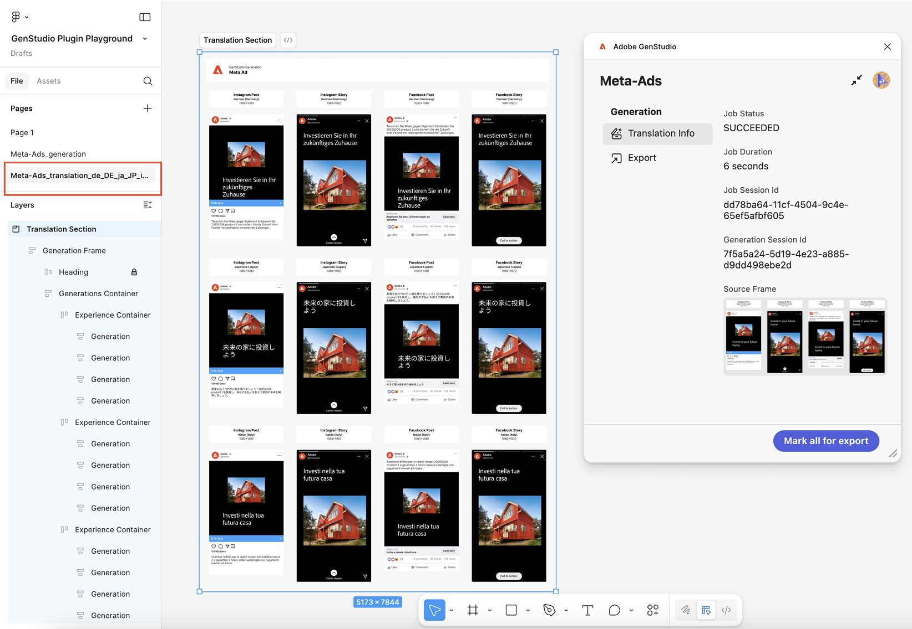
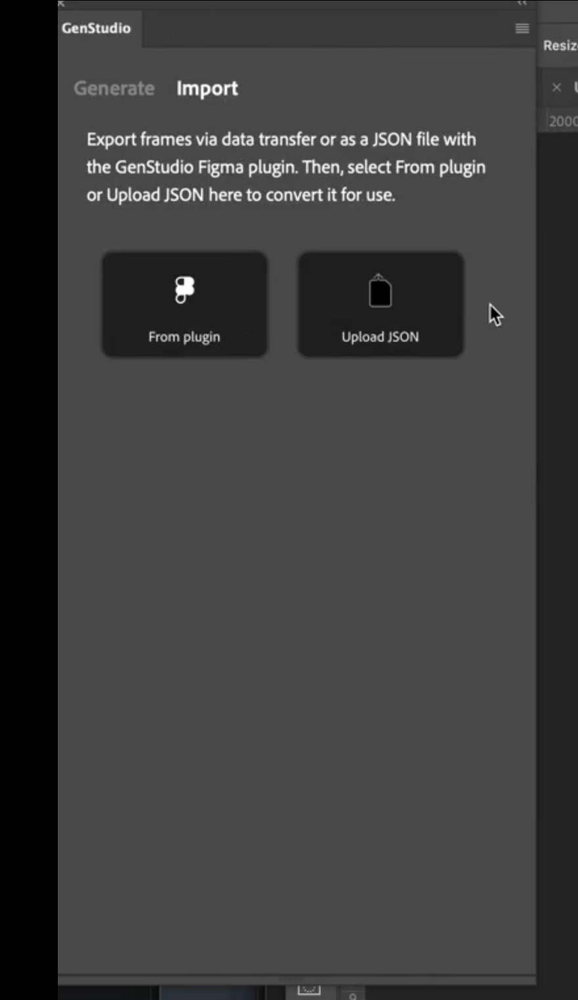
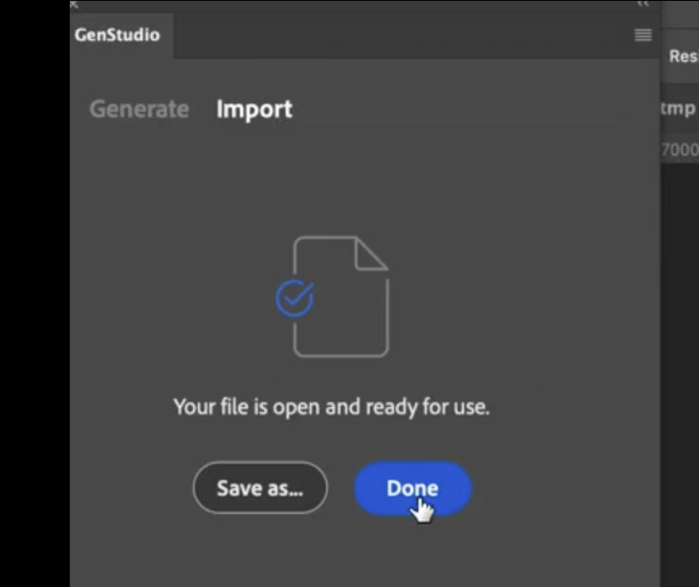

# GenStudio for Performance Marketing用 Figma プラグイン

GenStudio for Performance Marketing Figma プラグインは、Figma アプリケーションに新しいパネルを追加し、ブランドに即したコンテンツを生成できるようにします。
[Figma コミュニティマーケットプレイス &#x200B;](https://www.figma.com/community/plugin/1604251370122180013/firefly-enterprise-and-genstudio)からプラグインを検索してインストールします。

このページでは、プラグインの設定方法および使用方法を説明します。

このプラグインの機能は次のとおりです。

* Figma テキスト要素をGenStudio for Performance Marketing フィールド（`headline`、`body`、`on_image_text` など）にマッピングします。
* ブランド、ペルソナ、商品、テキストプロンプトに基づいて、新しいオンブランドMeta、LinkedIn またはディスプレイ広告 [!DNL Experiences] を生成します。
* マッピングされた Figma 要素のテキストをGenStudio for Performance Marketingで生成された値に置き換えることで、Figma ドキュメント内に [!DNL Experiences] を直接作成します。
* プロンプトに基づいて、既存のコンテンツをリフレーズ、短縮、延長または翻訳します。
* 生成された [!DNL Experiences] を複数の言語に翻訳します。
* 生成された [!DNL Experiences] を、統合された画像としてローカルソースに書き出します。
* 生成された [!DNL Experiences] をGenStudio for Performance Marketingに書き出します。
* Figma キャンバスで選択した要素に適応するプラグインオプションを使用します。

>[!VIDEO](https://video.tv.adobe.com/v/3478810?captions=jpn&learn=on)

## テンプレートの作成

この規則に従うには、プラグインに Figma ドキュメントの最初の 2 つのレベルが必要です。

* **セクション** – 親プロジェクトを表します。親プロジェクトには複数のテンプレートを含めることができます。
* **フレーム** - プロジェクト内のテンプレートを表します。 テンプレートには、テキスト、画像、コンポーネント、その他の要素を入力できます。

### Meta テンプレート

次のテンプレートサイズがサポートされています。

Instagram や Facebook の投稿の場合：

* 幅：1080 px （固定）
* 高さ：1080 ピクセルまたは 1350 ピクセル

Instagram や Facebook のストーリーの場合：

* 幅：1080 px （固定）
* 高さ：1920 ピクセル

プラグインは、テンプレートの高さに基づいて、生成されるエクスペリエンスのクロムを決定します。

### 表示テンプレート

固定サイズの要件はありません。 表示テンプレートは、任意のサイズをサポートします。

### LinkedIn テンプレート

* 幅：1200 px （固定）
* 高さ：1200 ピクセル、628 ピクセル、2292 ピクセル、1800 ピクセル、または 1500 ピクセル

### フィールドの役割マッピング

プラグインは、ヘッドライン、本文、画像など、テンプレートの様々な要素を理解する必要があります。

**Meta フィールドの役割には、**&#x200B;が含まれます。

* 画像
* 画像テキスト
* CTA
* Body text
* Headline
* Web サイト URL
* リンクを表示
* 手動フィールド

以下では、これらのフィールドロールの一部がどのようにマッピングされているかを説明します。

| {width="60%" align="center" zoomable="yes"}  | {width="70%" align="center" zoomable="yes"}  |
|:---:|:---:|
| {width="60%" align="center" zoomable="yes"}  | {width="70%" align="center" zoomable="yes"}  |

**LinkedIn フィールドの役割には**&#x200B;が含まれます。

* 画像
* 概要テキスト
* 画像テキスト
* Headline
* CTA
* Web サイト URL
* 手動フィールド

以下では、これらのフィールドロールの一部がどのようにマッピングされているかを説明します。

{width="30%" align="center" zoomable="yes"}

プラグインは、生成されたコンテンツに使用するためのこれらのマッピングを記憶しています。 1つのフィールドロールを複数のテンプレート要素にマッピングできます。 手動フィールドは、テキストの編集可能性を保持するエレメント用ですが、生成用にマークされません。

>[!IMPORTANT]
>
> **テンプレート内の少なくとも1つの画像要素に`image` フィールドの役割を割り当てることで、画像**&#x200B;をマッピングする必要があります。

要素役割を割り当てるには、次の手順に従います。

1. テンプレート内の要素（テキスト、画像など）を選択します。
1. ドロップダウンメニューを使用して役割を割り当てます。

{width="60%" zoomable="yes"}

{{$include /help/_includes/field-mapping-exceptions.md}}

## 新しいコンテンツを生成

GenStudio for Performance Marketing AI を使用して、Figma テンプレート内の要素を生成したり、バリエーションを作成したりします。

1. GenStudio Plugin Playgroundまたは既に用意されているテンプレートを使用している場合は、広告テンプレートを含むセクションノードを選択します。これは、**レイヤー** パネルから、またはキャンバスのセクションを直接クリックすることで実行できます。
   {width="50%" zoomable="yes"}
1. プラグインウィンドウで、バリエーションのプロジェクト名を入力し、コンテンツのプラットフォームを選択し、その他の必要な情報を入力します。次に、「**[!UICONTROL セットアップを完了]**」ボタンをクリックします。
   {width="30%" zoomable="yes"}
1. コンテンツ生成に使用する [!DNL Brand]、[!DNL Persona]、[!DNL Product] を選択します。
1. 作成するバリエーションの数を選択します（最大 8 つ）。
1. **[!UICONTROL コンテンツを選択]** の下にあるボタンを使用して、アセットから画像を参照して選択します。 最近追加された 40 個のアセットが最初に表示され、他のアセットを検索できます。 選択した画像は、テンプレートに合わせて自動的にサイズ変更されます。
1. テキストプロンプトを入力します。 **[!UICONTROL フィールド]** リストの各フィールドでは、新しいコンテンツの **[!UICONTROL アクション]** オプションが **[!UICONTROL 生成]** に設定されています。
1. すべてのフィールドの役割をマッピングします。 [&#x200B; フィールドロールマッピング &#x200B;](#field-role-mapping) を参照してください。
1. 「**[!UICONTROL 生成]** ボタンをクリックします。

## 既存のコンテンツからバリエーションを翻訳または生成してコピーする

GenStudio for Performance Marketing AI を使用して、広告コピーのバリエーションを生成したり、Figma テンプレートを翻訳したりします。

1. 広告テンプレートを含むセクションノードを選択します。これは、**レイヤー** パネルから、またはキャンバスのセクションを直接クリックすることで実行できます。
   {width="50%" zoomable="yes"}
1. プラグインウィンドウで、バリエーションのプロジェクト名を入力し、コンテンツのプラットフォームを選択します。
1. **[!UICONTROL 目標は何ですか？]** で **[!UICONTROL バリエーションを生成]** または **[!UICONTROL 翻訳]** を選択し、**[!UICONTROL 設定を完了]** ボタンをクリックします。
   {width="30%" zoomable="yes"}
1. コンテンツ生成に使用する [!DNL Brand]、[!DNL Persona]、[!DNL Product] を選択します。
1. 作成するバリエーションの数を選択します。
1. **[!UICONTROL コンテンツを選択]** の下にあるボタンを使用して、アセットから画像を参照して選択します。 最近追加された 40 個のアセットが最初に表示され、他のアセットを検索できます。 選択した画像は、テンプレートに合わせて自動的にサイズ変更されます。
1. テキストプロンプトを入力します。 **[!UICONTROL フィールド]** リストの各フィールドでは、新しいコンテンツの **[!UICONTROL アクション]** オプションが **[!UICONTROL 生成]** に設定されています。
1. すべてのフィールドの役割をマッピングします。 [&#x200B; フィールドロールマッピング &#x200B;](#field-role-mapping) を参照してください。
1. 各フィールドタイプを選択してバリエーションを生成するか、プラグインの左側のパネルで翻訳し、初期コンテンツを各 **[!UICONTROL 初期コンテンツ]** ボックスに貼り付けます。
   {width="60%" zoomable="yes"}
1. 「**[!UICONTROL 生成]** ボタンをクリックします。

## 生成後にコンテンツを翻訳

1. 翻訳する世代を選択します。
   {width="20%" zoomable="yes"}
1. 「**[!UICONTROL 翻訳]**」を選択し、「**[!UICONTROL 翻訳]**」をクリックします。
1. ターゲット言語（複数可）を選択します。
1. 「**[!UICONTROL 選択]**」をクリックします。

翻訳結果には、次のものが含まれます。

* 新しいページが翻訳済みコンテンツと共に表示されます。
* 各翻訳はターゲット言語またはロケールを示します。
* 元のページの元のコンテンツは変更されません。

{width="60%" zoomable="yes"}

## 生成後のコンテンツフィールドでのその他のアクション

フィールド内の既存のコンテンツを編集する場合は、プラグイン パネルに便利なオプションが表示されます。

{width="30%" zoomable="yes"}

オプションには、以下が含まれます。

* **[!UICONTROL Value]** を変更して、テキストを直接変更します。 このコンテンツを変更すると、選択したすべてのバリエーションに自動的に適用されます。
* AI は、次のような多くの **[!UICONTROL アクション]** オプションを実行できます。

| アクション | 説明 |
| --- | --- |
| **[!UICONTROL 生成]** | 新しいテキストバリエーションを生成します。 |
| **[!UICONTROL フレーズの変更]** | 新しいテキストバリエーションを生成します。 |
| **[!UICONTROL 短縮]** | テキストの短いバリエーションを生成します。 |
| **[!UICONTROL 延長]** | 長いバリエーションのテキストを生成します。 |

**[!UICONTROL アクション]** オプションを選択した後、「**[!UICONTROL 再生成]** ボタンを使用してコンテンツを再生成します。

## エクスペリエンスの書き出し

バリエーションは、Figma からGenStudio for Performance Marketing [!DNL Experiences] として書き出すことができます。

1. 次のいずれかの操作を行って、Figma キャンバスに書き出すコンテンツを選択します。
   * キャンバスで生成セクションを選択し、プラグインパネルの **[!UICONTROL エクスポート用にすべてマーク]** をクリックします。
     {width="20%" zoomable="yes"}
   * キャンバスで個々の世代を選択し、プラグインパネルの **[!UICONTROL エクスポート用にマーク]** をクリックします。
     {width="20%" zoomable="yes"}
1. サイドバーメニューから書き出し項目を選択します。
   {width="60%" zoomable="yes"}
1. 宛先を選択します。
1. **[!UICONTROL 書き出し]** をクリックして、コンテンツを書き出します。

プラグインパネルに ZIP ファイルが作成されるか、「GenStudioで開く **[!UICONTROL へのリンクが表示さ]** ます。 ZIP リンクを使用してファイルの保存場所を選択するか、「**[!UICONTROL GenStudioで開く]**」を選択します。

## Figma フレームのPhotoshopへの変換

>[!NOTE]
>
> このタスクを実行するには、Figma プラグインと[GenStudio Photoshop](photoshop-plugin.md)の両方が必要です。

Figma プラグインを使用して、Figma フレーム、複数フレーム、またはドキュメント全体をPhotoshop フォーマットに変換し、[GenStudio Photoshop](photoshop-plugin.md)で使用するために書き出すことができます。 現在、表示/非表示、フォントサイズ、基本レイヤー属性などの主要なプロパティのみが、変換時にサポートされます。 取り消し線、上付き文字、下付き文字、不透明度（割合）、グラデーションなどの機能は、まだサポートされていません。

このプラグインは、変換用に次の Figma レイヤータイプをサポートしています。

* **フレーム**
* **グループ**
* **インスタンス**
* **テキスト**
* **ベクトル**
* **画像**

PSDに変換すると、サポートされているレイヤーは次のようにPhotoshopにマッピングされます。

| Figma レイヤータイプ | Photoshopに変換 | メモ |
| --- | --- | --- |
| **フレーム** | 画層グループ | <ul><li>Figma フレームは、Photoshop レイヤーグループに変換されます。</li><li>ネストされたフレームはネストされたグループになります。</li><li>フレームサイズは、（選択範囲に応じて）PSD アートボードまたはグループの範囲になります。</li></ul> |
| **グループ** | 画層グループ | <ul><li>Figma グループは、Photoshop レイヤーグループに直接変換されます。</li><li>レイヤーの階層と重ね順は保持されます。</li></ul> |
| **インスタンス** | 画層グループ | <ul><li>コンポーネントとインスタンスは、標準のPhotoshop レイヤーグループに統合されます。 コンポーネントのメタデータとバリアントロジックは保持されません。</li><li>すべての子レイヤーはグループ内に残ります。</li></ul> |
| **テキスト** | テキストレイヤー | <ul><li>Figma テキストレイヤーは、編集可能なPhotoshop テキストレイヤーに変換されます。</li><li>テキストの階層と位置は保持されます。</li></ul> |
| **ベクトル** | シェイプレイヤー | <ul><li>Figma ベクターレイヤーはPhotoshop シェイプレイヤーに変換されます。</li><li>可能な場合、パスは保持されます。</li><li>サポートされていないエフェクトが適用されている場合、複雑なベクトルがラスタライズされることがあります。</li></ul> |
| **画像** | ラスター画層 | <ul><li>Figma イメージレイヤーはPhotoshop ラスターレイヤーに変換されます。</li><li>画像の拡大/縮小と配置は維持されます。</li></ul> |

### フレームの変換方法

フレームを変換するには：

1. Figma でFirefly Enterprise およびGenStudio プラグインを開き、プラグイン UI で「**[!UICONTROL 書き出し]**」タブをクリックします。
1. キャンバスで、書き出す 1 つまたは複数のフレームを選択します。 1 つまたは複数のフレームを選択できます。
1. 選択したフレームを移行するには、次のいずれかの操作を行います。

   * 「**[!UICONTROL エクスポート]**」をクリックして、変換したファイルを選択した場所にエクスポートするか、
   * 「**[!UICONTROL Photoshopに転送]**」をクリックして、変換されたファイルをキャッシュし、GenStudio Photoshopですぐに使用できます。
     {width="40%"}
1. 次に、Figma ファイルリンクを共有します。 プラグインには、変換を完了するためのFigma ファイル URLが必要です。 ドキュメントのURLを追加します。

   1. Figma で、キャンバスの右上隅にある「**[!UICONTROL 共有]**」をクリックします。
   1. **[!UICONTROL このファイルを共有]** で、「**[!UICONTROL リンクをコピー]**」をクリックします。
   1. コピーしたリンクを[!DNL GenStudio for Performance Marketing] プラグインダイアログの&#x200B;**[!UICONTROL Figma File link]** フィールドに貼り付けます。これは各ファイルに対して行う必要があります。
      {width="35%"}
   1. 「**[!UICONTROL 送信]**」をクリックします。 プラグインは、選択されたフレームを Figma で読み取り、JSON ドキュメントに変換します。JSON ドキュメントは、ファイルデータの仲介形式です。
1. ファイルの内容とメタデータを読み取るためのアクセス権を求めるポップアップが表示されます。これは、すべてのファイルに対して1回だけ実行する必要があります。「**[!UICONTROL アクセスを許可]**」をクリックします。
   {width="35%"}
1. Photoshopで、[!DNL GenStudio Photoshop]を開き、**[!UICONTROL 読み込み]** タブをクリックします。
1. 変換されたファイルを選択するには、次のいずれかの手順を実行します。

   * 「**[!UICONTROL プラグインから]**」をクリックして、**[!UICONTROL GenStudio Photoshopへの転送]**&#x200B;で変換されたファイルをキャッシュ済みファイルリストから選択するか、
   * 「**[!UICONTROL JSON をアップロード]**」をクリックし、アップロードする JSON ファイルを参照して選択します。
     {width="40%"}
1. GenStudio Photoshopは、JSON ドキュメントの情報を開いているPhotoshop ドキュメントに変換します。
1. 「**[!UICONTROL 完了]**」をクリックします。新しいファイルがPhotoshopで開き、使用する準備が整います。または、**[!UICONTROL 別名で保存…]**&#x200B;をクリックして、ファイルを保存する場所を選択します。
   {width="40%"}

## 世代履歴

プラグインは、各フィールドの変更履歴を保持します。 テンプレートページで、プラグインのサイドバーの **[!UICONTROL 生成履歴]** を選択します。

{width="80%" zoomable="yes"}

## トラブルシューティング

生成されたバリエーションでテキストや画像が置き換えられない場合は、次のベストプラクティスとヒントを考慮してください。

### マッピングされたフィールド

テキストまたは画像が置き換えられていない場合は、プラグイン UI でフィールドがGenStudio フィールドロールにマッピングされていることを確認してください。 [&#x200B; フィールドロールマッピング &#x200B;](#field-role-mapping) を参照してください。

### 使用可能なフォントの確認

生成時に置換を行うには、テキストフィールドのフォントがマシン上で使用可能である必要があります。 ファイルで使用されているすべてのフォントがお使いのマシンで使用できることを確認します（特に、ファイルが他のユーザーのマシンで作成された場合）。

### フィールドの役割のサポートを検討

特定のチャネルでは、特定のフィールドでの置換のみがサポートされます。 [&#x200B; フィールドの役割のマッピング &#x200B;](#field-role-mapping) に対する例外に注意してください。
