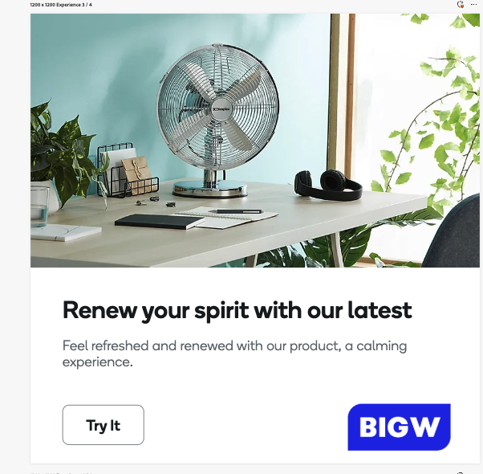

# テンプレートの使用に関するベストプラクティス

テンプレートを利用すれば、事前に設定されたレイアウトやデザイン要素を最初に確認できるため、新しいコンテンツの制作に必要な時間と労力を大幅に削減できます。

GenStudio for Performance Marketingでテンプレートを使用する場合は、次の推奨事項に従ってください。

1. [ テンプレート要素](#know-about-template-elements)について
1. コンテンツを効果的にパーソナライズするために[ チャネルガイドライン ](#configure-channel-guidelines)を設定します
1. 最適なエクスペリエンスを実現するために[ アクセシビリティ標準](accessibility-for-templates.md)でデザインする
1. [ チャネル固有のテンプレートガイドライン ](#follow-channel-specific-template-guidelines)に従う
1. [Express テンプレート ](/help/user-guide/templates/express-templates.md)を使用する場合は、[ExpressからGenStudio テンプレートのベストプラクティス ](#express-to-genstudio-template-best-practices)に関する具体的なヒントを検討してください。
>>
テンプレート要素と手順の基本については、[ テンプレートの操作](use-templates.md)を参照してください。 また、次回のキャンペーンで使用する具体的な手順については、[ テンプレートのカスタマイズ ](customize-template.md)について詳しく説明します。

## 適切なテンプレート要素の使用

それぞれのテンプレートタイプでは、異なる要素を使用して、チャネル固有のコンテンツを制作するための構造を作成します。 [ テンプレートの一部を理解し、コンテンツとテンプレートタイプに最適な要素を含めます](use-templates.md#template-elements)。

テンプレートをカスタマイズする場合は、GenStudio for Performance Marketingを使用してコンテンツを生成する必要がある場所で、これらの要素の代わりにフィールド名を使用します。

[ テンプレート要素](use-templates.md#template-elements)を参照してください。

## テンプレートでのプレースホルダーテキストの使用

プレースホルダーテキストは、後でユーザーがテンプレートに入力するコンテンツの構文や構造を定義するのに役立ちます。 例えば、{first_name}.{last_name}@emailなどのように電子メールアドレスを定義します。 ただし、一部の一般的な区切り記号は、GenStudio for Performance Marketingの他の意味に対して既に予約されています。

❌ `< >` - HTML タグに使用されています。
❌ `{{ }}` - ハンドルバー式に使用されています。

既存のタグとの混同を避けるために、単一の角かっこを使用してプレースホルダーテキストを示します。

✅ `{first_name}` – 名のプレースホルダー。

## チャネルガイドラインの設定

明確なチャネルガイドラインを定義することは、生成するコンテンツがブランドの要件と目的に合致していることを確認するために不可欠です。 チャネルガイドラインでは、テンプレートで使用するトーン、長さ、スタイルなどの要素のルールを指定できます。 例えば、本文の最大文字数を設定したり、特定のcall-to-action スタイルを必要としたりできます。 これらのガイドラインを事前に設定することで、AI プロンプトごとに詳細な指示を書く必要性を減らし、コンテンツ生成プロセスを合理化し、メール全体の一貫性を確保できます。

テンプレート内のすべてのキーフィールドについて、ブランドの[ チャネルガイドライン ](/help/user-guide/guidelines/brands.md#channel-guidelines)を確認し、定義します。 ガイドラインを定義しない場合、[ デフォルトのチャネルガイドライン ](/help/user-guide/guidelines/brands.md#default-channel-guidelines)が適用され、ブランド要件が完全に反映されない可能性があります。

[ ブランド、製品、およびペルソナのガイドライン ](/help/user-guide/guidelines/overview.md)が生成されたコンテンツにどのように影響するか、およびマーケティング目標に合わせてそれらを調整する方法について説明します。

## テンプレートの画像のアップロード

テンプレートで使用する画像は、コンテンツリポジトリから取得し、画像が正確に表示されるように正しくアップロードする必要があります。

テンプレートにエッジからエッジまで（裁ち落とし）画像が含まれている場合、選択した画像はテンプレート全体のサイズに合わせて自動的にサイズ変更されます。 ただし、画像がテンプレートの縦横比と一致しない場合、画像はテンプレートの寸法に合わせて切り抜かれ、期待どおりに表示されない可能性があります。

テンプレートに含まれる画像の「自動調整」機能はありません。

画像の切り抜きを解決するには、テンプレートで使用する画像がコンテンツリポジトリーにアップロードされるときに、その画像の縦横比を定義する必要があります。 承認済みテンプレートをアップロードする場合：

1. [ テンプレートのアップロードプロセス ](/help/user-guide/templates/use-templates.md#add-a-template)を進めて、**[!UICONTROL 詳細を追加]** ページに到達します。

2. テンプレートで使用する画像の縦横比を&#x200B;**[!UICONTROL 広告幅（px）]**&#x200B;および&#x200B;**[!UICONTROL 広告の高さ（px）]**&#x200B;で定義します。 これにより、画像を表示するテンプレートのセクションの画像ウィンドウが定義されます。

3. **[!UICONTROL 詳細]** セクションで、**[!UICONTROL 画像サイズ]** ドロップダウンを選択し、_固定サイズに切り抜く_を選択します。
   {width="80%"}

ブラウザーで画像のサイズと縦横比を決定するには：

1. 画像を確認します。
   - Windows/Linuxの場合：
      - F12を押します。
   - MacOSの：
      - Command + Option + I キーを押します。

1. 画像にカーソルを合わせます。

1. 縦横比を確認します。 これを使用して、テンプレート内の画像の縦横比を定義します。

これらのディテールがアップロード中に適用されない場合、画像はテンプレートの縦横比全体と見なされ、その縦横比と一致しない画像は正確に切り抜かれます。

{width="60%"}

ディスプレイ広告テンプレートで&#x200B;**❌切り抜かれた画像**

ディスプレイ広告に表示される{width="60%"}

**✅画像が完全に表示されました**

## チャネル固有のテンプレートガイドラインに従う

テンプレートを作成する際には、テンプレートが意図したチャネルの特定の要件を満たしていることを確認します。 各チャネルのレイアウトと視覚的な要件に対応するテンプレートを作成します。 あらゆるテンプレートに適用される一般的なガイドラインがあります。

- クリーンでレスポンシブなHTMLとインライン CSSの使用
- Adobe フォントまたはGoogle フォントの使用
- JavaScriptを&#x200B;**使用しない**&#x200B;人

{{note-css-effects}}

最適なパフォーマンスを確保するために、各テンプレートタイプを操作する際のヒントと制約について説明します。

- [メール](/help/user-guide/templates/email-template.md)
- [ディスプレイ広告とバナー広告](/help/user-guide/templates/display-template.md)
- [LinkedIn](/help/user-guide/templates/linkedin-template.md)
- [Meta広告](/help/user-guide/templates/meta-template.md)

## ExpressからGenStudioへのテンプレートのベストプラクティス

以下のヒントは、デザインを[!DNL Adobe Express]から[!DNL GenStudio for Performance Marketing]のテンプレートに変換する際に、信頼できる結果を得るのに役立ちます。

### マルチバリエーションのテンプレートの使用

[!DNL Adobe Express]では、ページは1つのテンプレートファイルで複数のサイズまたは縦横比のバリエーションを表すことができます。
[!DNL GenStudio for Performance Marketing]でテンプレートを選択すると、すべてのバリエーションがキャンバスに表示されます。

このビヘイビアーは、ファイルごとに1つのバリエーションのみをサポートするHTML テンプレートで改善されます。

### マーケターが編集できるフィールドをロックする

ロック機能を使用して、意図を伝える。 例えば、免責条項をロックして、AIが生成しないようにします。見出しを柔軟に生成できるようにします。

[!DNL Adobe Express]の任意の要素を右クリックして、ロック動作を設定します。

- **[!UICONTROL 完全ロック]** – 要素は静的で、AIはその要素のコンテンツを生成しません。
- **[!UICONTROL ロック、画像の置換を許可]** — サイズと位置をロックしますが、ユーザーは画像を入れ替えることができます。 このオプションは、ロゴに適しています。
- **[!UICONTROL ロック、テキスト置換を許可]** — サイズと位置をロックしますが、ユーザーはテキストを編集できます。 AIはコンテンツを自動生成しません。
- **完全に柔軟** （ロック解除） – ユーザーは要素を移動およびサイズ変更でき、AIはそれを生成するコンテンツとして扱います。

### レイヤーに名前を付けてAI マッピングを向上

デザインをテンプレートに変換すると、AIがデザインをスキャンし、見出し、CTA、本文などのフィールドをマッピングします。 AIは、非常に複雑なレイアウトよりも単純なテンプレートを正確にマッピングできます。

**ベストプラクティス：** プレースホルダーコピーには、AIがフィールドを正しくマッピングするために意図したフィールドタイプ（`headline`、`sub-headline`、または`CTA`など）を含めます。 この方法は、マッピングエラーを減らすことができます。

### テンプレートに変換

1. [!DNL Adobe Express]で、**[!UICONTROL 共有]** > **[!UICONTROL テンプレートに変換]**&#x200B;をクリックします。
1. **[!UICONTROL 情報]** タブと&#x200B;**[!UICONTROL ロック]** タブのみが[!DNL GenStudio for Performance Marketing]に引き継がれます。
1. コンバージョン時に、ロック解除の仕組みを選択します。
   - **[!UICONTROL ユーザーにロック解除を許可]**
   - **[!UICONTROL すべてのロック解除を禁止]**
   - **[!UICONTROL パスフレーズを設定]** – 永続的なアクセスをブロックせずにカジュアルな変更を妨げる中間グラウンド。

### 元のデザインファイルのコピーを保持する

変換すると、別の[!DNL Adobe Express] テンプレートファイルが作成されますが、元のデザインファイルは編集可能のままです。

**ヒント：**&#x200B;元のテンプレートを残しておくと、デザインを修正したり、バリエーションを作成したり、後で新しいテンプレートを生成したりできます。

### 共有して可視性を向上

変換後、テンプレートはデフォルトでのみ表示されます。 個人または組織全体で共有できます。

**要件：** [!DNL Adobe Express]と[!DNL GenStudio for Performance Marketing]は、テンプレートを同期するために同じIMS組織を使用する必要があります。 テンプレートは通常、コンバージョン直後に[!DNL GenStudio for Performance Marketing]に表示されます。

### AI フィールドマッピングの制御

テンプレートを選択すると、AIはテンプレートごとにフィールドを1回マッピングし、**[!UICONTROL プライマリメディア]**、**[!UICONTROL 生成]**、**[!UICONTROL ロック]**&#x200B;などのラベルを割り当てます。 AIが誤ってフィールドを割り当てた場合は、マッピングを手動で調整できます。

フィールドごとに&#x200B;**[!UICONTROL 生成を有効にする]** トグルを使用して、生成する前にオンまたはオフにします。 AIが誤ってフィールドを割り当てた場合は、マッピングを手動で調整できます。 テンプレートマッピングの永続的な修正は、今後のリリースで予定されています。

### [!DNL Adobe Express]でデザインし、[!DNL GenStudio for Performance Marketing]でアセンブリ

各サービスを最大限に活用するために、次のデザインワークフローを検討してください。

- [!DNL Adobe Express]のカラー、レイアウト、グラフィックなどのデザイン作業を完了します。
- [!DNL GenStudio for Performance Marketing]を使用して、これらのテンプレートからコンテンツを組み立てて生成します。
- デザインガバナンスには、[!DNL Adobe Express]個のブランド（色、ロゴ、フォント、グラフィック）を使用します。
- 生成後のフォントカラーの変更に[!DNL GenStudio for Performance Marketing] ブランドを使用します。

### 電子メールの制限

Horizon Canvasでは、[!DNL Adobe Express] テンプレート ワークフローの電子メールは&#x200B;**サポートされていません**。 メールでは、従来のHTMLテンプレートプロセスが引き続き使用されます。

### カスタムフォントの活用

チームは、カスタムフォントが[!DNL Adobe Express]個のテンプレートでどのように機能するかを頻繁に尋ねます。 管理者は、これらのフォントを使用する前に、Admin Consoleでカスタムフォントの選定オファーを受け入れる必要がある場合があります。[ テンプレートの使用 [!DNL Adobe Express] を参照してください。](express-templates.md)
