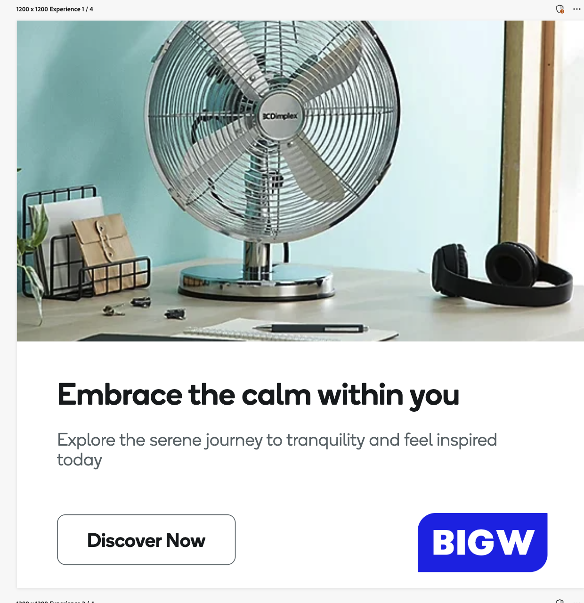
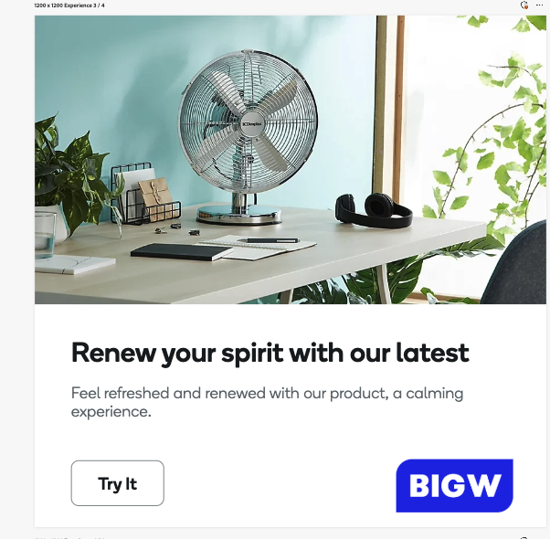

# テンプレート使用のベストプラクティス

テンプレートは、事前に設定されたレイアウトやデザイン要素を含む開始点を提供して、新しいコンテンツを生成するのに必要な時間と労力を大幅に削減します。

GenStudio for Performance Marketing でテンプレートを使用する際は、次のレコメンデーションに従ってください。

1. [テンプレート要素](#know-about-template-elements)について理解する
1. 効果的なコンテンツのパーソナライゼーションを実現するために[チャネルガイドライン](#configure-channel-guidelines)を設定する
1. 最適なエクスペリエンスを提供するために[アクセシビリティ標準](accessibility-for-templates.md)を使用して設計する
1. [チャネル固有のテンプレートガイドライン](#follow-channel-specific-template-guidelines)に従う
1. [Express テンプレート](/help/user-guide/templates/express-templates.md)を使用する際は、[Express から GenStudio へのテンプレートに関するベストプラクティス](#express-to-genstudio-template-best-practices)で説明されている特定のヒントを考慮する
&#x200B;>>
テンプレート要素と手順の基本について詳しくは、[テンプレートの操作](use-templates.md)を参照してください。 また、次のキャンペーンで使用する特定の指示に対して[テンプレートをカスタマイズ](customize-template.md)する方法についても、詳細に掘り下げていきます。

## 適切なテンプレート要素の使用

各テンプレートタイプでは、チャネル固有のコンテンツ制作に対する構造を作成するために、様々な要素を使用します。 [テンプレートの各部分を理解](use-templates.md#template-elements)し、コンテンツやテンプレートのタイプに最適な要素を含めます。

テンプレートをカスタマイズする際、GenStudio for Performance Marketing にコンテンツを生成させる必要がある箇所では、これらの要素の代わりにフィールド名を使用します。

[テンプレート要素](use-templates.md#template-elements)を参照してください。

## テンプレートでのプレースホルダーテキストの使用

プレースホルダーテキストは、ユーザーが後でテンプレートに入力するコンテンツの構文や構造を定義するのに役立ちます。 例えば、メールアドレスを定義するための {first_name}.{last_name}@email.etc. などがあります。 ただし、GenStudio for Performance Marketingでは、一部の一般的な区切り記号が既に他の意味として予約されています。

❌ `< >` - HTML タグに使用されています。
❌ `{{ }}` - ハンドルバー式に使用されています。

既存のタグとの混同を回避するために、プレースホルダーテキストを示す際には、単一の括弧（直角括弧または中括弧）を使用します。

✅ `{first_name}` - 名のプレースホルダー。

## チャネルガイドラインの設定

生成されたコンテンツがブランドの要件や目標に一致するようにするには、明確なチャネルガイドラインを定義することが不可欠です。 チャネルガイドラインを使用すると、テンプレートで使用されるトーン、長さ、スタイルなどの要素に関するルールを指定できます。 例えば、本文の最大文字数を設定したり、特定のコールトゥアクションのスタイルを必須としたりできます。 これらのガイドラインを事前に設定すると、各 AI プロンプトに詳細な指示を記述する必要が削減され、コンテンツ生成プロセスが効率化されると共に、メール全体の一貫性が確保されます。

テンプレート内のすべての主要なフィールドについて、ブランドの[チャネルガイドライン](/help/user-guide/guidelines/brands.md#channel-guidelines)を確認および定義します。 ガイドラインを定義しない場合、[デフォルトのチャネルガイドライン](/help/user-guide/guidelines/brands.md#default-channel-guidelines)が適用され、ブランド要件が完全に反映されない場合があります。

[ブランド、製品、ペルソナのガイドライン](/help/user-guide/guidelines/overview.md)が生成されるコンテンツに与える影響の仕組みと、マーケティング目標に合わせてカスタマイズする方法について説明します。

## テンプレート用の画像のアップロード

テンプレートで使用する画像はコンテンツリポジトリから取得し、正しく表示されるように正しくアップロードする必要があります。

テンプレートに端から端まで（フルブリード）配置される画像が含まれている場合、選択した画像はテンプレートの全体サイズに合わせて自動的にサイズ変更されます。 ただし、画像の縦横比がテンプレートと一致しない場合、画像はテンプレートの寸法に合わせて切り抜かれるので、意図したとおりに表示されないことがあります。

テンプレートに含まれる画像には、「自動調整」機能はありません。

画像の切り抜きを解決するには、テンプレートで使用する画像をコンテンツリポジトリにアップロードする際、その画像の縦横比を定義する必要があります。 承認済みのテンプレートをアップロードする場合、次の手順に従います。

1. **[!UICONTROL 詳細を追加]**&#x200B;ページに到達するまで、[テンプレートのアップロード手順を進めます](/help/user-guide/templates/use-templates.md#add-a-template)。

2. テンプレートで使用する画像の縦横比を、**[!UICONTROL 広告の幅（px）]**&#x200B;と&#x200B;**[!UICONTROL 広告の高さ（px）]**&#x200B;で定義します。 これにより、画像を表示するテンプレートのセクションの画像ウィンドウが定義されます。

3. 「**[!UICONTROL 詳細情報]**」セクションで、**[!UICONTROL 画像サイズ]**&#x200B;ドロップダウンを選択し、「_固定サイズに切り抜き_」を選択します。
   {width="80%"}

ブラウザーで画像のサイズと縦横比を決定するには：

1. 画像を検査します。
   - Windows／Linux の場合：
     - F12 キーを押します。
   - macOS の場合：
     - Command + Option + I キーを押します。

1. 画像にポインタを合わせます。

1. 縦横比に注意してください。 これを使用して、テンプレート内の画像の縦横比を定義します。

これらの詳細がアップロード時に適用されない場合、画像はテンプレートの全体縦横比と見なされ、その縦横比と一致しない画像は切り抜かれて表示されます。

{width="60%"}

**❌ディスプレイ広告テンプレートでの切り抜かれた画像**

{width="60%"}

**✅完全に表示された画像**

## チャネル固有のテンプレートガイドラインに従う

テンプレートを作成する際には、そのテンプレートが対象チャネルの特定の要件を満たしていることを確認してください。 各チャネルのレイアウトと視覚的な要件に対応するテンプレートを作成します。 あらゆるテンプレートに適用される一般的なガイドラインがあります。

- クリーンでレスポンシブな HTML とインライン CSS を使用する
- アドビフォントまたは Google フォントを使用する
- JavaScript を&#x200B;**使用しない**

{{note-css-effects}}

最適なパフォーマンスを得るために各種テンプレートタイプを使用する場合は、その他のヒントと制約を参照してください。

- [メール](/help/user-guide/templates/email-template.md)
- [ディスプレイ広告とバナー広告](/help/user-guide/templates/display-template.md)
- [LinkedIn](/help/user-guide/templates/linkedin-template.md)
- [Meta 広告](/help/user-guide/templates/meta-template.md)

## Express から GenStudio テンプレートへの変換のベストプラクティス

>[!VIDEO](https://video.tv.adobe.com/v/3502403?learn=on&enablevpops)

以下のヒントは、デザインを [!DNL Adobe Express] から [!DNL GenStudio for Performance Marketing] のテンプレートに変換する際に、信頼できる結果を得るのに役立ちます。

### 複数バリエーションのテンプレートを使用

[!DNL Adobe Express]では、ページは1つのテンプレートファイルで複数のサイズまたは縦横比のバリエーションを表すことができます。
[!DNL GenStudio for Performance Marketing]でテンプレートを選択すると、すべてのバリエーションがキャンバスに表示されます。

この機能は、1 つのファイルで 1 つのバリエーションしかサポートされない HTML テンプレートではさらに効果的です。

### フィールドをロックしてマーケターが編集できる対象を制御

意図を伝えるためにロックを使用します。 例えば、AI で生成されないように法的免責事項はロックし、見出しは柔軟に生成できるようにします。

[!DNL Adobe Express] で任意の要素を右クリックして、次のようなロック動作を設定します。

- **[!UICONTROL 完全ロック]** - 対象要素は静的で、AI はその要素のコンテンツを生成しません。
- **[!UICONTROL ロック、画像の置換を許可]** - サイズと位置がロックされますが、ユーザーは画像を入れ替えることができます。 このオプションはロゴに適しています。
- **[!UICONTROL ロック、テキストの置換を許可]** - サイズと位置がロックされますが、ユーザーはテキストを編集できます。 AI はこの要素のコンテンツを自動生成しません。
- **完全に柔軟**（ロック解除） - ユーザーは対象要素の移動とサイズ変更ができ、AI はそれを生成対象コンテンツとして扱います。

### AI マッピングが向上するようにレイヤーに名前を付ける

デザインをテンプレートに変換すると、AI がデザインをスキャンし、見出し、CTA、本文コピーといったフィールドをマッピングします。 AI は、複雑なレイアウトよりも単純なテンプレートの方が正確にマッピングすることが多いです。

**ベストプラクティス：**&#x200B;プレースホルダーコピーには、AI がフィールドを正しくマッピングできるように、目的のフィールドタイプ（`headline`、`sub-headline`、`CTA` など）を含めます。 このアプローチにより、マッピングエラーを減らすことができます。

### テンプレートに変換

1. [!DNL Adobe Express] で、**[!UICONTROL 共有]**／**[!UICONTROL テンプレートに変換]**&#x200B;をクリックします。
1. 「**[!UICONTROL 情報]**」タブと「**[!UICONTROL ロック]**」タブのみが [!DNL GenStudio for Performance Marketing] に引き継がれます。
1. コンバージョン時に、次のようなロック解除の動作を選択します。
   - **[!UICONTROL ユーザーがロック解除できるようにする]**
   - **[!UICONTROL すべてのロック解除を禁止]**
   - **[!UICONTROL パスフレーズを設定]** - アクセスを恒久的にブロックすることなく安易な変更を抑制する中間的な方法です。

### 元のデザインファイルのコピーを保持

変換すると別の [!DNL Adobe Express] テンプレートファイルが作成されますが、元のデザインファイルは編集可能なままです。

**ヒント：**&#x200B;後でデザインを修正し、バリエーションを作成し、新しいテンプレートを生成できるように、オリジナルを保管しておいてください。

### 可視性を高めるための共有

変換後、テンプレートはデフォルトでユーザーにのみ表示されます。 個人または組織全体と共有できます。

**要件：**&#x200B;テンプレートを同期させるには、[!DNL Adobe Express] と [!DNL GenStudio for Performance Marketing] で同じ IMS 組織を使用する必要があります。 [!DNL GenStudio for Performance Marketing] では通常、変換後すぐにテンプレートが表示されます。

### AI フィールドマッピングの制御

テンプレートを選択すると、AI はテンプレートごとにフィールドを 1 回マッピングし、**[!UICONTROL プライマリメディア]**、**[!UICONTROL 生成済み]**、**[!UICONTROL ロック済み]**&#x200B;などのラベルを割り当てます。 AI がフィールドを誤って割り当てた際、マッピングを手動で調整できます。

生成する前に、フィールドごとに&#x200B;**[!UICONTROL 生成を有効にする]**&#x200B;切替スイッチを使用して、生成のオンまたはオフにします。 AI がフィールドを誤って割り当てた際、マッピングを手動で調整できます。 テンプレートマッピングの完全な修正は、今後のリリースで予定されています。

### [!DNL Adobe Express] でデザインし、[!DNL GenStudio for Performance Marketing] で組み立て

各サービスを最大限に活用するために、次のデザインワークフローを考慮します。

- [!DNL Adobe Express] で、カラー、レイアウト、グラフィックなどのデザイン作業を完了させる。
- [!DNL GenStudio for Performance Marketing] を使用し、これらのテンプレートからコンテンツを組み立てて生成する。
- デザインガバナンスには、[!DNL Adobe Express] のブランド（カラー、ロゴ、フォント、グラフィック）を使用する。
- 生成後のフォントカラー変更には、[!DNL GenStudio for Performance Marketing] のブランドを使用する。

### メールの制限

[!DNL Adobe Express] テンプレートワークフローに対する Horizon キャンバスでは、メール機能はサポートされて&#x200B;**いません**。 メールでは、引き続き従来の HTML テンプレートプロセスが使用されます。

### カスタムフォントの活用

[!DNL Adobe Express] テンプレートを使用したカスタムフォントの仕組みについて、多くの場合、チームから質問を受けます。 管理者は、カスタムフォントを使用する前に、Admin Console でカスタムフォントの選定オファーを受け入れる必要がある場合があります。[&#x200B; [!DNL Adobe Express]  テンプレートの使用](express-templates.md)を参照してください。
