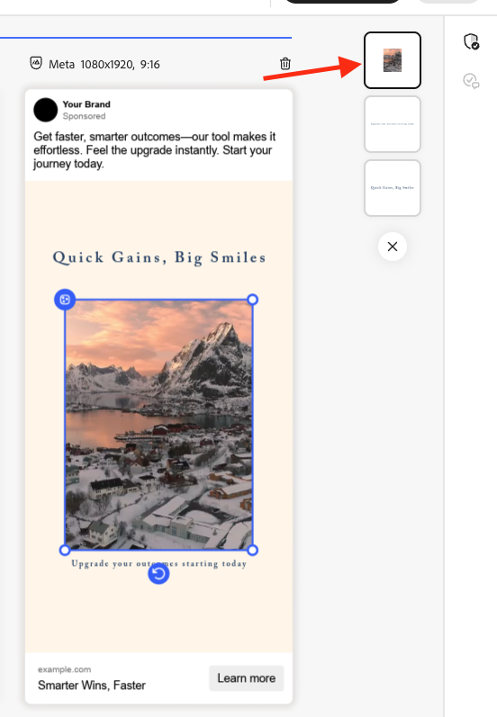
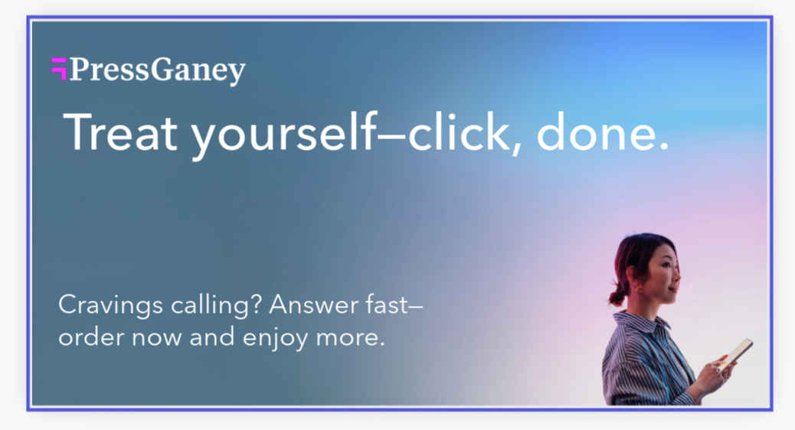

# [!DNL Adobe Express] テンプレートの使用

[!DNL Adobe Express][!DNL GenStudio for Performance Marketing] 作成および設計されたテンプレートを使用できます。 [!DNL Adobe Express] からブランドアセットを取り込み、これらの強力なツールを使用して、魅力的なマーケティングキャンペーンや [!DNL Experiences] に統合します。

このガイドでは、要件と機能を [!DNL Adobe Express] のテンプレートで説明します。

## [!DNL Adobe Express] のテンプレートについて

ま [!DNL Adobe Express]、アプリケーションに用意されている [ 既存のスターターテンプレートを使用して新しいドキュメントを作成する ](https://helpx.adobe.com/express/web/documents-and-presentations/text-flow-template.html?x-product=Helpx%2F1.0.0&x-product-location=Search%3AForums%3Alink%2F3.7.5) か、次のような便利なブランド制限を含めることができる [ カスタムテンプレートを使用する ](https://helpx.adobe.com/express/web/brands-libraries-projects/create-manage-brands/edit-shared-template.html) ことができます。

- [ ロックされた要素 ](https://helpx.adobe.com/express/web/invite-collaborate/object-locking.html) 変更できない
- 必要に応じてユーザーが要素のロックを解除する方法を制御する制限をロックします

[!DNL Adobe Express] のテンプレートに設定されたロック設定も、[!DNL GenStudio for Performance Marketing] で適用されます。 [ ブランド制限  [!DNL Adobe Express]  カスタムテンプレートを作成する手順 ](https://helpx.adobe.com/express/web/brands-libraries-projects/create-manage-brands/template-control.html) を使用します。

Express テンプレートでカスタムフォントを使用するには、管理者はまず、Admin Console でカスタムフォントの対象となるオファーを受け入れる必要があります。このオファーは、Express ライセンス使用権の一部として含まれています。

## Express テンプレートの検索

ユーザーには、Express テンプレートを選択するための「作成」に新しいタブが表示されます。 Express テンプレートは、次の場合にGenStudio for Performance Marketingでアクセスできます。

- ユーザーによる作成
- ユーザーに共有
- ユーザーの組織に共有（両方のアプリで同じ IMS 組織を使用）

テンプレートタイプを選択した後、作成ワークフローで使用可能な Express テンプレートを見つけます。 Express テンプレートは、次のタイプでのみ使用できます。

- [!DNL Meta]
- [!DNL Display]
- [!DNL LinkedIn]
- [!DNL TikTok]

**[!UICONTROL テンプレートを選択]** の下の上部バーで、**Express テンプレート** を見つけます。

{width=70%}

[!DNL Express] テンプレートを選択して「**[!UICONTROL 使用]** をクリックすると、ドラフト前のパラメーターとプロンプトが左側のポップアップパネルに表示されます。 「**[!UICONTROL 生成]**」ボタンをクリックして、選択したテンプレートで新しいコンテンツを作成します。

{width=90%}

>[!IMPORTANT]
>
>コンテンツの生成中、Express テンプレートレイヤーは、[!DNL GenStudio for Performance Marketing] 用のフィールドの役割で自動的にタグ付けされます。 テンプレート上の要素は、[ 手動でタグ付け ](#manual-tagging-of-templates) することもできます。

## [!DNL Adobe Express] テンプレートを使用したバリアントとア [!DNL Experiences] ットについて

[!DNL Express] テンプレートには、（他のバリアントの管理 [ の際に知り合いになると思われる多くの同じ機能が用意されてい ](https://experienceleague.adobe.com/en/docs/genstudio-for-performance-marketing/user-guide/create/manage-variants#manually-edit-text) す。 ただし、[!DNL Express] のコンテンツのワークフローを効率化するために、いくつかの強力な追加機能があります。 この節では、[!DNL Adobe Express] 実装専用の機能について説明します。

### 複数のサイズの自動生成

[ で 1 つのアセットに対して複数のページが作成された  [!DNL Express]](https://helpx.adobe.com/express/web/arrange-layers-and-pages/add-pages.html) 場合、それらのページはそのアセットから作成された任意のテンプレートに引き継がれます。 Express ページは、それぞれ異なるサイズのクリエイティブコンテンツとして [!DNL GenStudio for Performance Marketing] に生成されます。

1 つのアセットに対してサイズの異なる複数のコンテンツが存在する場合 [!DNL Express]、1 回の生成ですべてのサイズのバリアントを生成できます。

### 要素の再配置とサイズ変更

テンプレート上の要素は、キャンバスペイン上でクリックしてドラッグするだけで、サイズを調整したり移動したりできます。

サイズを変更するには、コーナーポイントから要素をクリックしてドラッグします。

### キャンバス ペインのヘッダ機能

キャンバス ペインのヘッダのボタンを使用して、次の操作を行います。

1. ドラフトのタイトルを変更
1. 表示するズームのレベルを変更する
1. 変更の取り消しとやり直し

### エクスペリエンスグループのフィードバックを割り当て

生成されたバリアントの各グループにフィードバックを割り当てます。 これらのフィードバックラベルは、AI が次世代で考慮する必要があるバリアントを理解するのに役立ちます。

「。..」をクリックします ドロップダウンを開く対象：

- 良好な出力
- 出力の低下
- 削除 – バリアントのグループを削除します。

### バリアントの削除

エクスペリエンスのグループで生成された単一のバリアントサイズは、ごみ箱アイコンを使用して削除できます。

{width=300}

### スペースバーからパン

**[!UICONTROL スペース]** キーを押したままにして、クリック アンド ドラッグ機能を有効にしてキャンバス ビューペインを「引っ張る」ことができます。

ビュー・ペインは、2 本指のスクロールで移動することもできます。

### テキストを手動で編集

生成されたバリアントのテキストフィールドを編集できます。 様々なフレーズや言葉を試したり、書式を適用したりして、オーディエンスのテキストを絞り込みます。 例えば、画像のレイアウトに合わせてバリアントのテキストを太字で右揃えにすることができます。

{width=60%}

使用可能なテキストフォーマットには、次のものがあります。

- 太字、斜体、下線
- テキストカラー（黒、白、ブランドカラー）
- 左揃え、中央揃え、右揃え
- 箇条書きリストと順序付きリスト
- テキストサイズ
- 上付きまたは下付き

**生成されたバリアントでテキストを手動で編集するには**:

1. バリアントのセットを生成した後、バリアント内の編集可能なテキストをダブルクリックします。
1. 新しいテキストを入力します。
1. テキストの書式を設定するには、テキストボックス要素でをクリックするか、を入力します。 ポップアップバーに書式設定オプションが表示されます。 Shift キーを押すと、テキストを表示するバーが非表示になります。
1. テキストフィールドの外側をクリックして、変更を保存します。

### レイヤーを表示

バリアントの個々のレイヤーをすばやく選択し、セクションの再生成や画像の切り抜きなどの変更を行うことができます。 個々のレイヤーを選択すると、レイヤー内の編集可能なフィールドや画像がハイライト表示されます。

**バリアントのレイヤーを表示するには**:

1. バリアントのセットを生成したら、バリアント内の編集可能なフィールドまたは画像をクリックします。 レイヤーは右上のタイルの行に表示されます。
   {width=50%}
1. レイヤータイルをクリックして選択します。 バリアントで選択したレイヤーがハイライト表示されます。
1. 選択したレイヤーに必要な編集を加えます。

### セクションを書き換え

[!DNL GenStudio for Performance Marketing] には、生成されたバリアントのセクションを再生成する機能が組み込まれています。 テキストのフレーズを変更、短縮、長くしたり、新しいプロンプトを追加して新しいコンテンツを生成したりできます。

例えば、あるMeta広告バリアントのヘッドラインセクションを再生成して、特定の背景アセットでどのように見えるかを確認できます。 ガイドのプロンプトを使用して、セクションのテキストコンテンツを **[!UICONTROL 再フレーズ]**、**[!UICONTROL 短縮]**、または **[!UICONTROL 延長**[!UICONTROL 、または ]**再生]** できます。

{width=50%}

**個々のバリアントセクションを書き換えるには**:

1. バリアントのセットを生成した後、バリアント内の編集可能なテキストをシングルクリックします。 杖アイコンが表示されます。
1. 杖アイコンをクリックして、書き換えペインを開きます。
1. 既存のテキストを変更するには、「**[!UICONTROL 再語句]**」、「**[!UICONTROL 短縮]**」または「**[!UICONTROL 長くする]**」を選択します。
1. 新しい言葉遣いオプションを生成するには、「**[!UICONTROL 再生成]**」を選択し、新しいプロンプトを入力します。
   1. 「**[!UICONTROL 生成]**」をクリックします。
1. 結果は、パネルにオプションとして表示されます。 目的のオプションを選択し、「**[!UICONTROL 置換]**」をクリックします。 バリアントが、改訂されたテキストで更新されます。

{width=50%}

### アセットの切り抜き

切り抜きツールを使用すると、生成された個々のバリアントで画像アセットを手動で切り抜いたり再配置したりできます。

**バリアント内の画像の切り抜きと再配置**

1. バリアントのセットを生成した後、アセットをダブルクリックして境界ボックスをアクティブにします。
1. 任意のエッジまたはコーナーからドラッグして画像のバウンディングボックスを調整するか、画像全体を目的の位置にドラッグします。

### アセットの入れ替え

キャンバス UI から直接生成されたバリアントに、画像、承認済みのロゴまたはビデオアセットを追加または入れ替えることができます。

**バリアント内のアセットを追加またはスワップするには**:

1. バリアントのセットを生成したら、アセット（画像が現在存在しない場合は画像アセット領域）をクリックします。 スワップアイコンが表示されます。
1. スワップアイコンをクリックして、アセットを選択ページを開きます。
1. GenStudio Assets のコンテンツ ビューのフィルターと検索機能を使用して、検索結果をさらに絞り込むことができます。
1. また、connected [!DNL Adobe Experience Manager] （AEM）Assets Content Hub リポジトリで利用可能な画像を使用するには、そのリポジトリを **[!UICONTROL Location]** メニューから選択します。
1. 画像をクリックして選択し、「**[!UICONTROL 使用]**」をクリックします。 画像が追加されるか、該当するバリアントに入れ替えられます。

### テンプレートの手動によるタグ付け

テンプレート内の要素は、作成ワークフローでの [ テンプレートの生成 ](#find-express-templates) 中に自動的にタグ付けされます。 ただし、これらの要素は手動でタグ付けすることもできます。

**テンプレート要素を手動でタグ付けするには**:

1. テンプレート上の要素を選択します。
1. ドロップダウンを使用して、その要素のタグを選択します。
   {width=80%}

タグ付けのオプションは、要素のタイプによって異なります。

### テンプレートロックの制限

テンプレートには [ ロックされた要素 ](https://helpx.adobe.com/express/web/invite-collaborate/object-locking.html) を含めることができます。これらの要素は [!DNL Express] から引き継がれ、一部の機能の変更方法を制御します。 これらの設定は、テンプレートによって考慮され、テンプレートで変更することもできます。

1. テンプレート上でロックされた要素を選択します。
1. 選択した要素の左上にあるロックアイコンをクリックします。
1. 正しいオプションを選択して、要素のロックを解除します。
   {width=60%}

### ビデオアセンブリ

ビデオを含むテンプレートでは、ビデオアセンブリ機能を利用できます。

**ビデオアセンブリを使用するには**:

1. エクスペリエンスを選択し、「**[!UICONTROL 編集]**」ボタンをクリックしてフォーカスモードに切り替え、ビデオアセンブリ機能を使用します。 単一のバリアントのみが表示され、下に沿ってシーン ラインが表示されます。
   {width=70%}
1. ビデオエクスペリエンスを調整します。 ビデオアセンブリのオプションは次のとおりです。
   - ビデオを再生
   - サウンドのミュートとミュート解除
   - 「+」ボタンで新しいビデオコンテンツを追加
   - ビデオ期間設定
   - ドラッグ&amp;ドロップによるビデオコンテンツの順序の変更
1. ビデオの編集が完了したら、上部の **[!UICONTROL 終了]** ボタンを使用して変更を保存し、無限キャンバスに戻ります。

### 生成展開を使用して画像を変更する

画像レイヤーの境界を AI で拡張して、エクスペリエンス内の必要なサイズに合わせることができます。

**生成展開を使用して画像を展開するには**:

1. ロック解除された画像レイヤーを選択し、画像フレームの下部にある **[!UICONTROL 展開]** ボタンをクリックします。
   {width=70%}
1. 画像が展開される目的の寸法にフレームを引っ張ります。 展開オプションウィンドウが表示されます。 「展開」オプションでは、次の方法で拡張を容易にすることができます。
   - プロンプトの入力
   - フレームに合わせるを選択
   - 寸法をリセット
     {width=50%}
1. **[!UICONTROL 展開]** をクリックして、世代を作成します。 選択するバリエーションがフレームの下部に表示されます。
1. 最適なバリアントを選択して、「**[!UICONTROL 保持]**」をクリックします。
   {width=50%}

{width=60%}

### ブランドの検証

_コンテンツチェック_ パネルを使用して、一貫したブランドアイデンティティ、ADA アクセシビリティ標準、プラットフォームガイドライン、バリアントの配置を維持します。

[ ブランド検証 ](/help/user-guide/guidelines/brand-validation.md) を参照してください。

## レビューして承認

バリアントを編集および調整した後、[ レビューと承認ワークフロー ](https://experienceleague.adobe.com/en/docs/genstudio-for-performance-marketing/user-guide/approve/overview) を使用してコンテンツを承認して公開します。
